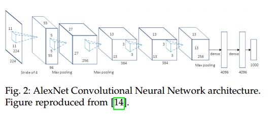
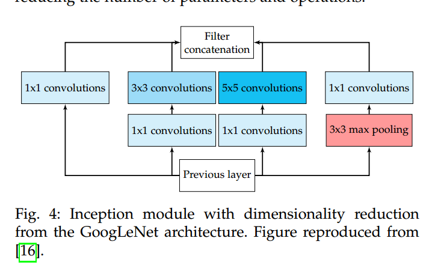
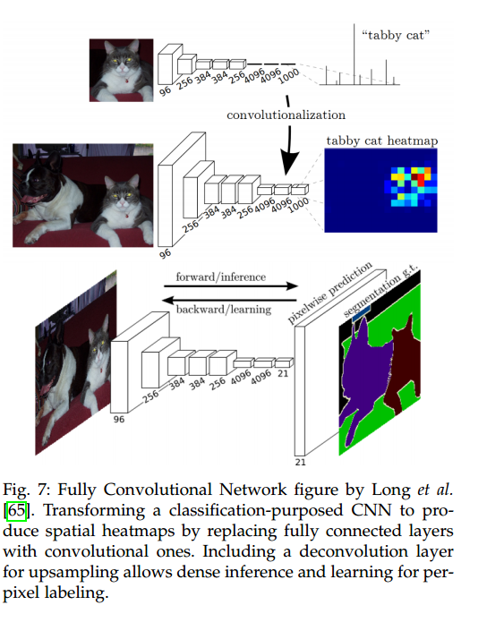
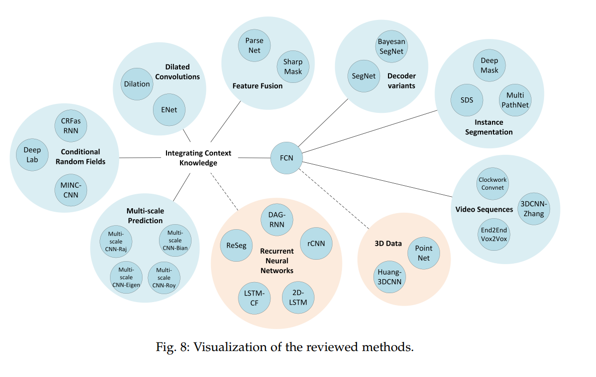
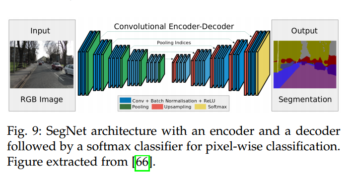
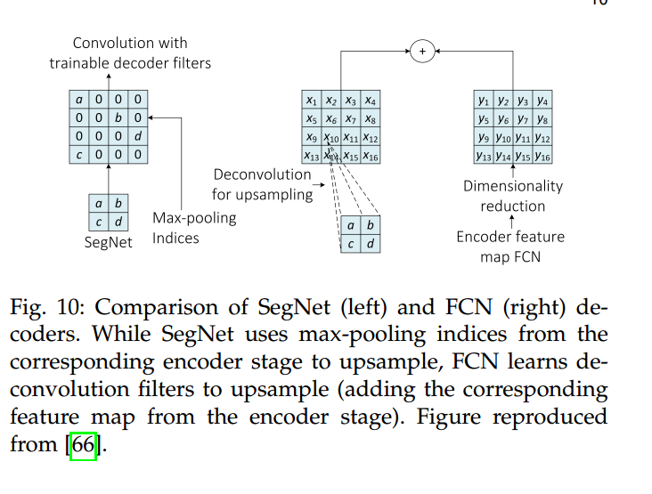
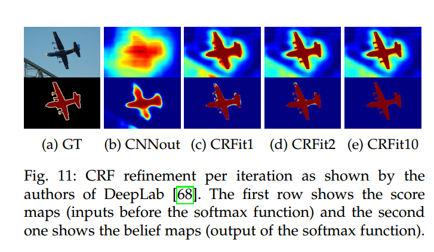
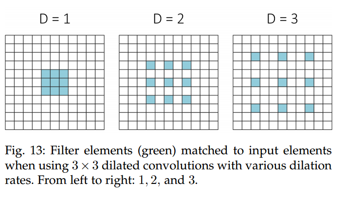
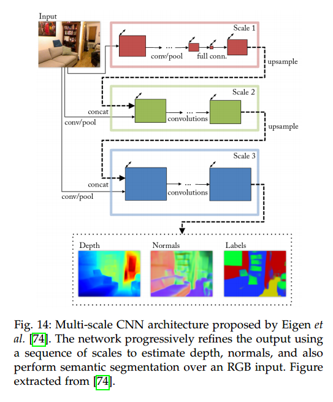
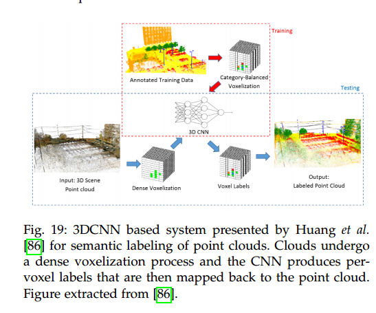

## A Review on Deep Learning Techniques Applied to Semantic Segmentation

* [paper](paper/2017-A%20Review%20on%20Deep%20Learning%20Techniques%20Applied%20to%20Semantic%20Segmentation.pdf)
* [语义分割中的深度学习方法全解：从FCN、SegNet到各代DeepLab](https://zhuanlan.zhihu.com/p/27794982)
* [十分钟看懂图像语义分割技术](https://www.leiphone.com/news/201705/YbRHBVIjhqVBP0X5.html)
* [SemanticSegPaperCollection](https://github.com/shawnyuen/SemanticSegPaperCollection)

### Abstract

* 自从2015年FCN首次将深度学习应用到语义分割中，深度学习便开始在语义分割领域一统江湖。下面将回顾总结一下深度学习下的语义分割。
* 目标识别经历了4个发展阶段：图像分类，目标检测，语义分割，实例分割。这个过程是从粗糙到细粒度的一个过程。 \

### 1 INTRODUCTION

* 语义分割是一个计算机视觉领域的关键问题
* 看一张大图片，语义分割是为完全的场景解译铺路的高层次任务。
* 场景解译的重要性这么突出的原因是：越来越多的应用在从图片中推理知识的时候效果不好。
    * 这些应用： 自动驾驶、人机推理。计算机摄影、图像搜索引擎、增强现实等等
* 在过去，这些问题被多样的传统计算机视觉技术和机器学习方法解决了。
* 深度学习方法利用深度架构、卷积神经网络提高了这些应用的准确性，甚至更有效。
* 深度学习技术没有在计算机视觉和机器学习领域已经建立的这些方法成熟，所以缺乏统一的评论。
* 该领域日新月异的状态，使得跟上发展的步伐看起来直觉上很困难，因为大量新的文献出现使得学习也很耗时。
* 我们的主要贡献：
    * 我们研究了已经存在的数据集，它们对使用深度技术做分割任务可能是有帮助的；
    * 已有深度学习方法做语义分割任务的，它们的组织和贡献的回顾。
    * 评估表现： 质量测量（准确率）、运行时间、内存足迹；
    * 前述方法和一些未来可能工作的讨论，总结这个领域的最好成果。
* 论文的组织方法：
    2. 语义分割的背景知识
    3. 数据集
    4. 已有方法回顾
    5. 讨论
    6. 总结

   

### 2 TERMINOLOGY AND BACKGROUND CONCEPTS

* 语义分割不是一个单独的领域，这是一个从粗糙到精细推理的逐渐过程。
* 起源是分类任务，它要求在整个输入中做一个预测。
* 定位和检测是下一步，这一步不仅需要类别信息，也需要位置或者框选信息。
* 最终要的是为每个像素分类。

#### 2.1 Common Deep Network Architectures

1. AlexNet
    * ILSVRC-2012 with a TOP-5 test accuracy of 84.6% 
    
    
2. VGG
    * 92.7% TOP-5 test accuracy. 
    * 使用堆叠的小的卷积在第一层中而不是大的卷积。
        * 更少的参数和更非线性。
        * 判决函数更具有区分性
        * 网络也更容易训练。
    
    
3. GoogLeNet
    *  TOP-5 test accuracy of 93.3%.
    
        * network in network
        * pooling 
        * large-sized convolution layer
        * small-sized convolution layer
    * 考虑内存和计算损耗，有效减少参数和操作。

4. ResNet
    * ILSVRC-2016 with 96.4% accuracy.
    * 采用恒等连接，解决深度架构问题。
        * 保证下一层学习一些新东西，
        * 解决梯度消失问题。
    
    
5. ReNet
    * 没看懂
    
    
#### 2.2 Transfer Learning

* 从头训练一个深度网络通常不可行：
    * 有效尺寸的数据集需要
    * 网络收敛需要太长时间
    * 使用预训练过得权值比随机初始化的权值更好
* 从相关程度不高的任务中迁移特征也会比随机初始化的好。
* 使用这种迁移学习技术不是那么直接
    1. 结构限制，必须找到预训练的网络，因此不是提出新的网络结构，而是直接使用已有的网络，
    2. fine-tuning的训练过程和从开始训练的不同。正确选择需要fine-tune的层是重要的。
        * 通常是高层
        * 低层包含通用的特征，也为学习率选择适当的政策，
    3. 数据集大小
        * 收集和创建逐像素的分割数据集，是困难的
        * 尺寸没有ImageNet大，

#### 2.3 Data Preprocessing and Augmentation

* 数据增强对机器学习模型训练
    * 加速收敛
    * 正则化，避免过拟合
    * 增强泛化能力
* translation, rotation, warping, scaling, color space shifts, crops, etc

### 3 DATASETS AND CHALLENGES

* 每个数据集都解决分割问题的一些子问题。

#### 3.2 2D Datasets

* PASCAL Visual Object Classes (VOC)
    * 分类、检测、分割、动作分类、人布局。
    * 21类，
        * 汽车，房子，动物
        * 飞机，自行车，游艇，汽车，公交车，摩托，火车
        * 瓶子，椅子，餐桌，盆栽，沙发，电视
        * 鸟，猫，牛，狗， 马，羊，人
    * training and validation with 1464 and 1449
    
* PASCAL Context 
    * dataset is an extension of the PASCAL VOC 2010 detection challenge 
        * contains pixel-wise labels for all training images (10103). 
    * 540 classes 
        * objects, stuff, and hybrids
        * 59 most frequent
    
* PASCAL Part 
    * dataset is an extension of the PASCAL VOC 2010 detection challenge 
    * all training and validation images from PASCAL VOC + 9637 testing images.

* Semantic Boundaries Dataset (SBD)
    * dataset is an extended version of PASCAL VOC 
        * provides semantic segmentation ground truth for those images that were not labelled in VOC. 
        * It contains annotations for 11355 images from PASCAL VOC 2011.
        * Those annotations provide both category-level and instance-level information, apart from boundaries for each object. 
        * SBD provides its own training (8498 images) and validation (2857 images) splits. 
        * Due to its increased amount of training data, this dataset is often used as a substitute for PASCAL VOC for deep learning.
    
* Microsoft Common Objects in Context (COCO)
    * more than 80 classes, 
    * more than 82783 images for training, 
    * 40504 for validation, 
    * test set consist of more than 80000 images. divided into four different subsets 
        * test-dev (20000 images) for additional validation, debugging, 
        * test-standard (20000 images) is the default test data for the competition and theone used to compare state-of-the-art methods, 
        * test-challenge (20000 images) is the split used for the lenge when submitting to the evaluation server,
        * test-reserve (20000 images) is a split used to protect against possible overfitting in the challenge
  
* SYNTHetic Collection of Imagery and Annotations(SYNTHIA)
    * large-scale collection of photorealistic renderings of a virtual city, semantically segmented,
    * purpose is scene understanding in the context of driving or urban scenarios
    * 11 classes 
        * void, sky, building, road, sidewalk, fence,vegetation, pole, car, sign, pedestrian, and cyclist
    *  13407 training images from rendered video streams.
    
* Cityscapes
    * large-scale database which focuses on semantic understanding of urban street scenes. 
    * 30 classes grouped into 8 categories 
        * (flat surfaces, humans, vehicles, constructions, objects, nature, sky, and void). 
    *  5000 fine annotated images and 20000 coarse annotated ones
    
* CamVid 
    * road/driving scene understanding database 
    * annotated with 32 classes
        * void, building, wall, tree, vegetation, fence, sidewalk, parking block, column/pole, 
        * traffic cone, bridge, sign, miscellaneous text, traffic light, sky, tunnel,
        * archway, road, road shoulder, lane markings (driving), lane markings (non-driving), 
        * animal, pedestrian, child, cart luggage, bicyclist, motorcycle, car
        * SUV/pickup/truck, truck/bus, train, and other moving object.
    
* KITTI
    * popular datasets for use in mobile robotics and autonomous driving
    

 没有看完
​    
​    
​    
​    
### 4 METHODS

* 目前语义分割最优秀的架构是FCN架构
    * 将之前的分类网络最后的全连接层换成卷积
    * 上采样的到原图大小
    * 设置输入可以是任意尺寸
    
    * 缺乏多样的特征限制了它的应用
        * 空间不变性无法获得有用的全局信息，
        * 不是实例敏感的，
        * 有效性仍然和实时高分辨分割有差距
        * 对非结构化的数据不适合

#### 4.1 Decoder Variants

* 将分类网络改为分割网络

* SegNet
    * 每个解码层保持了相应编码层的最大采样位置。

#### 4.2 Integrating Context Knowledge

* 语义分割需要整合多尺度空间信息，平衡局部和全局信息。
* 池化层使网络保持不变性，和计算成本，获得全局上下文信息
* 许多操作帮助CNN获得全局信息
    * CRFs
    * dilated convolutions
    * multi-scale aggregation

1. Conditional Random Fields
* CNN固有的不变性，限制分割任务的准确性
* 利用后处理（CRFs）来获得更好的细节信息
    * CRF组合地层图片信息（像素之间的联系）和高层的输出来产生像素级的分类。
    * 这种组合对于获得长依赖和局部细节的信息重要的
* DeepLab 使用全连接 pairwise CRF作为单独的后处理步骤获得分割的结果
    * 为每个像素与其它像素建立关系，不管两者距离多远
    * 通过使用这种模型，短的和长的关系都被考虑了，使得网络可以恢复细节信息。
    * 尽管全连接是低效的，但是这个模型通过概论推断可以有效近似
    
* CRFasRNN
    * FCN + CRF
    * 端对端训练模型
    
2. Dilated Convolutions
* 指数级扩张感受野不损失分辨率

* 通常是扩张核的大小， 中间填充0

* 天然与多层次上下文聚合模型相协调

3. Multi-scale Prediction
* CNN的每个参数都会影响到生成的特征图的尺寸。
    * 这意味着核隐式在特定尺寸下检测的特征图
    * 这些参数是用来处理手边的问题的，这使得模型处理不同尺度问题困难
        * 同一事物，不同尺度，特征图应该不一样
* 使用多尺度网络得到不同尺度下的特征图，然后融合得到单个的预测结果。

4. Feature Fusion
* 增加上下文信息到全卷积架构作为语义分割方法： feature fusion. 
* merge 全局特征 (从网络前面层中提取出来的) with 局部特征图（extracted from a subsequent layer）.

5. Recurrent Neural Networks
* CNN对局部信息处理不好
* RNN采用拓扑结构的优势，应用在长时短时序列上
* 通过这种方式，连接像素级别和局部信息，RNN有效获取全局信息，提升语义分割。
* 缺点：
    * 图片缺乏自然的序列结构
    * RNN关注一维输入

#### 4.3 Instance Segmentation

* 实例分割是语义分割的下一步
* 给一个类别的每个实例标：
    * 处理过程不是那么直接
    * 实例的个数是未知的，
    * 评估预测表现不是像语义分割那样逐个像素的

#### 4.4 RGB-D Data

没看懂

#### 4.5 3D Data

* 3D数据增加了空间信息
* CNN设计不是来解决非结构数据的

#### 4.6 Video Sequences

