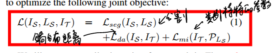

* [paper](paper/2016-FCNs%20in%20the%20Wild%20Pixel-level%20Adversarial%20and%20Constraint-based%20Adaptation.pdf)

> 如果训练集和测试集数据没有假设的特性，则直接测试，如果有，那么可以先学习数据间的域变换特性，然后辅助分割。

### 动机

* 当训练数据与测试数据不同域的时候，以前的方法很差
* 提出了无监督对抗方式对像素预测问题，包括全局和类别特别的适应技术，

### 假设

* 源域和目标域共享相同的标签空间，并且源模型在目标域上实现的性能大于机会。

### 创新

* 提出无监督域适应方法来迁移FCN结果的图片域；
* 组合全局和局部对齐方法，使用全局和类别特别的一起做贡献；

### 方法

* 框架

* 主要思想

* 两个域之间可能发生全局变化，导致相应特征空间的边际分布偏移。 这可能发生在任何两个不同的域之间，但在非常不同的域之间的大转变中将是最明显的，例如在模拟域和真实域之间进行调整；
* 由于类别特定的参数变化而发生主要移位。 这可能是由于在两个域中具有特定偏差的各个类别。 例如，当在两个不同城市之间进行调整时，汽车的分布和标志的外观可能会改变。
* 整体损失函数

* 损失函数2

