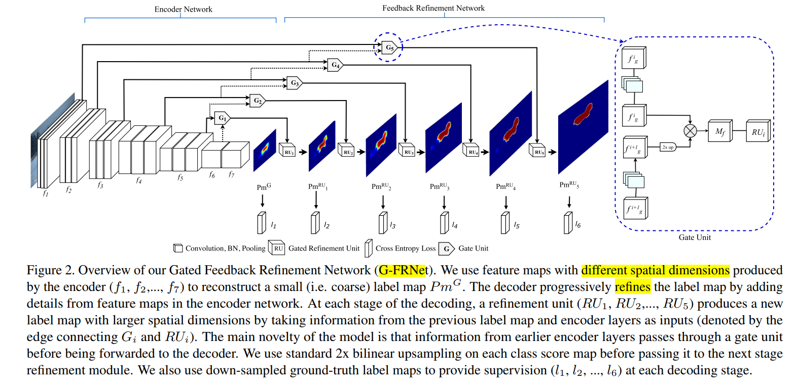
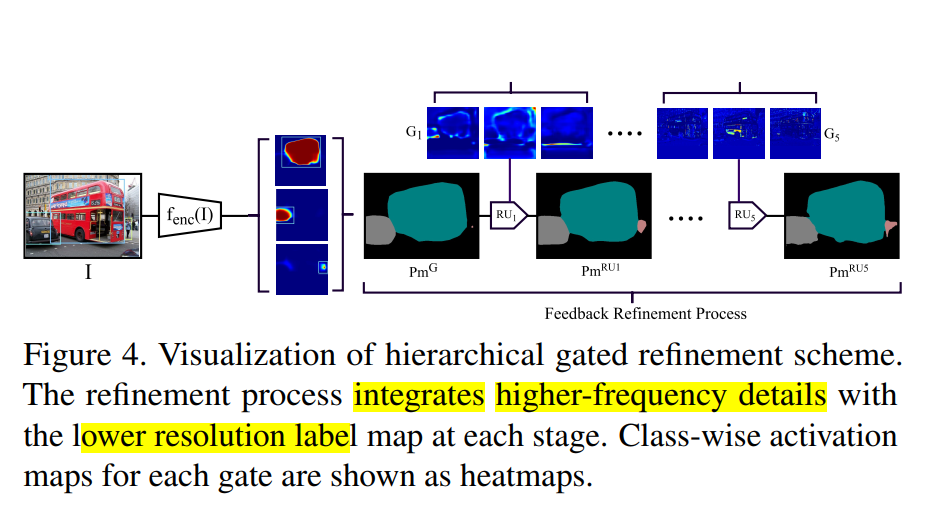

* [paper](paper/2017-Gated%20Feedback%20Refinement%20Network%20for%20Dense%20Image%20Labeling.pdf)

* 理论出发点

* 为什么需要低层特征
  * 编码解码直接级联的方式，是的解码从具有最高层编码的特征开始，仅仅对于某些类别良好。
* 如何使用低层特征
  * 低层编码特征具有良好的定位信息，但是不具有区分度。
  * 低层特征的使用方法，直接使用可能导致歧义，缺乏区分度信息。

* G-FRNet架构图，利用多层特征解码

* 创新点： 我们主要的创新点是使用门机制来模式化信息通过跳跃链接。我们不是直接上采样得到输出，而是先通过f5计算一个G1，直观来说f6包含能够修复f5歧义表示的部分。

  

* 如何从门单元提取特征。

  1. 3x3卷积模块分别操作两个输入
  2. 上采样低分辨特征， 然后两个特征进行element-wise product，
  3. 将MF送入门提炼单元

  

* 门提炼单元
  

  * 门提炼单元两个输入：来自上一层的输出和门特征图。门提炼单元聚合打的空间维度特征通过下面几步骤：

  1. mf做一个3x3的卷积单元操作

  2. mf和rf融合，在最后一个维度叠加
  3. 对得到的（R+M）f进行3x3的卷积单元操作。

  

* 损失函数

  

* 网络效果示意图

### 实验

* voc 图片大小  320x320
