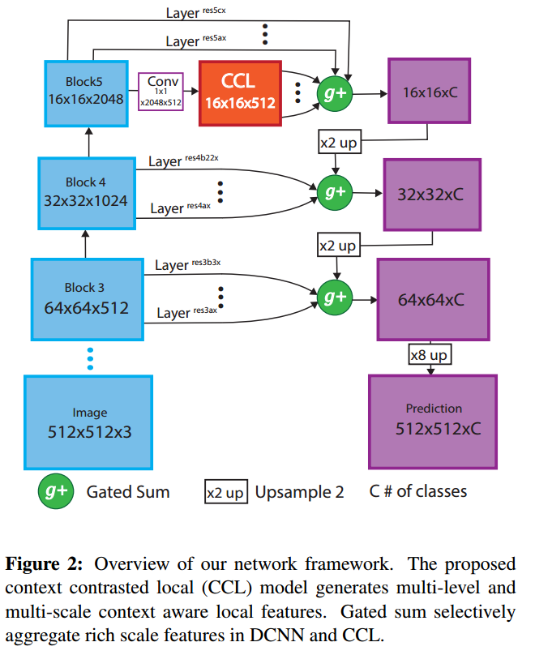
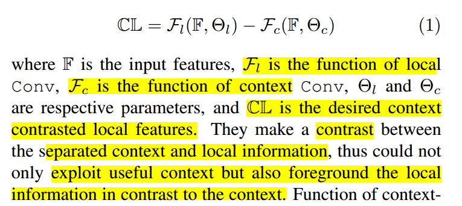
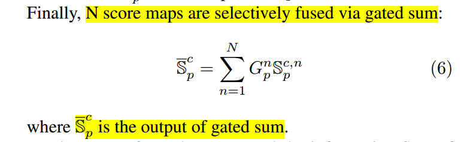

* [paper](paper/2018-Context%20Contrasted%20Feature%20and%20Gated%20Multi-Scale%20Aggregation%20for%20Scene%20Segmentation.pdf)

### 动机

* 第一个工作的动机，（context contrasted local (CCL) model  ）
  * 作者认为获得有判别力的语义特征以及多尺度融合是提升性能的关键；
  * 上下文通常具有平滑的表示，并且由显着对象的特征支配，这对于标记不显眼的对象和东西是有害的。
  * 用于场景分割的更好的特征是有区别的情境感知局部特征，即，在知道上下文信息的同时，像素位置p的特征将不被图像的其他部分支配。
* 第二个工作的动机（门控和）
  * 由于场景分割中物体的巨大尺度变化，基于单个尺度特征对所有单个像素进行分类是不合理的。

### 贡献

* 我们提出了一种新的上下文对比局部特征，其被定制用于场景分割并且提出上下文对比局部（CCL）模型以获得多尺度和多级上下文对比的局部特征。
* 我们进一步提出了一个门控和，以选择性地聚合每个空间位置的适当比例特征，这是解决多尺度对象存在问题的有效且有效的方法。

### 方法

### 网络架构

* 整体架构

  

  #### 1. Context Contrasted Local Feature （CCL）

  * 由于场景分割中对象和内容的复杂性，不加选择地收集上下文信息会带来有害的噪声，尤其是在杂乱的环境中。

  

* 融合上下文信息和局部细节：

* 网络结构

* 实验效果

#### 2.  Gated Multi-scale Aggregation 

* 网络结构

* RNN： 因此，所有信息图依次被送到RNN以学习这些信息图的关系。基于RNN，这些信息图可以知道邻域地图并获取所有信息地图之间的序列关系；我们假设高层特征学习了良好的低层特征，所以我们从高层特征开始，

* 生成的gate

* gate融合结果：

* 门控制着跳跃层信息的流动，

* sum V.S. gated sum
  * sum默认每个特征图都是权值为1，sum融合不考虑不同输入的个体特征，并且只能不加区分地融合所有输入。
  * gated sum：通过其固有的门选择性地聚合每个位置解析的适当得分图。门Gn p调整其值以适应测试输入特征以控制跳过层的信息流。

### 实验

* CCL对于不显著目标的效果

