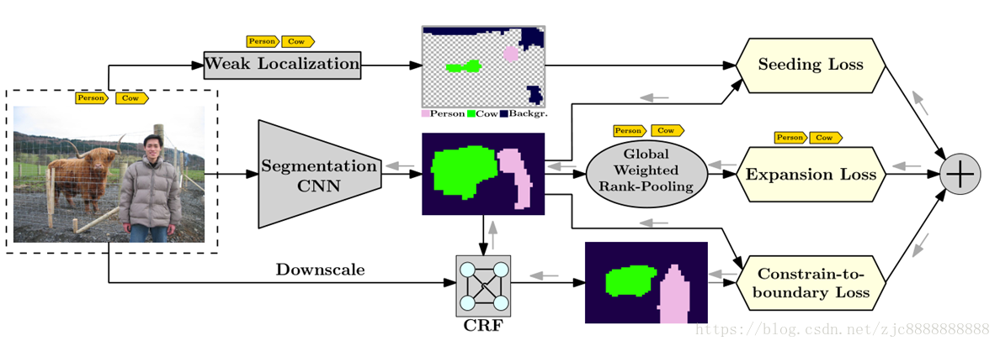

* [paper](paper/2016-Seed,%20expand%20and%20constrain%20Three%20principles%20for%20weakly-supervised%20image%20segmentation.pdf)

### 概括

* Seeding Loss——对目标进行弱定位（weak localization）生成初始mask
* Expansion Loss——对弱定位的mask进行合理的扩大
* Constrain-to-boundary Loss——对扩大后的mask进行合理的约束，更贴近目标边界
* 因此将该方法命名为SEC（Seed + Expand + Constrain）

### 创新

- 图像分类神经网络，例如AlexNet 或VGG，可用于生成可靠的对象定位线索（种子），但无法预测对象的确切空间范围。 我们通过使用种子损失来结合这一方面，该种子损失鼓励分割网络匹配定位提示，但是对于图像的其余部分是不可知的。
- 为了从每个图像标注训练分割网络，可以使用全局池化层将分割mask聚合成图像级标签分数。该层的选择对分割的质量有很大影响。 例如，最大池化倾向于低估对象的大小，而平均池化往往会高估它。 我们提出了一个全球加权等级池化，它通过扩展损失来利用，将对象种子扩展到合理规模的区域。 它扩展了最大池化和平均池化，并在我们的实证研究中表现优于它们。
- 从图像级标签训练的网络很少捕获图像中对象的精确边界。 在测试时通过全连接条件随机场（CRF）进行后处理通常不足以克服这种影响，因为一旦网络经过训练，他们就会对错误分类的区域产生信心。 我们提出了一种新的约束到边界损失，可以在训练时缓解不精确边界的问题。 它努力约束预测的分割mask以重视低级图像信息，特别是对象边界。

### 框架

### Seeding loss

* 首先需要使用某种方法对图像中的目标进行弱定位（weak localization），所谓的弱定位，就是通过图像层面（image-level）的label对图像中的目标进行定位。采用的主要方法为CAM（Class Activation Mapping）—— Learning Deep Features for Discriminative Localization（CVPR 2016）

* Seeding loss的流程及效果如**图2** 所示，图片中主要有两个目标：person和cow（图2 左），使用弱定位方法将两个目标以及背景分别生成热力图（图2 中），最后合成，生成这三类的初始位置信息（图2 右）

* Seeding loss定义如下：

* 其中$f(X)$表示在图像$X$中，区域$u$被预测为类别$c$的概率，$Sc$表示通过弱定位得到的那些被标注为类别$c$的区域由此式，seeding loss可以**约束神经网络，使其只关注那些高亮区域，而忽略剩余区域，提高预测能力;**

### Expansion loss  

* 由于Seeding loss生成的弱定位区域太小，没有实用性，因此需要对其进行合理的扩大，而Expansion loss就是为此而设计
* 为了训练一个图像分割网络，可以使用全局池化层，将卷积层得到的特征图（即segmentation mask）进行全局池化操作，得到对应的图像层面的label得分
* 全局池化主要有两种：
  1. Global Max Pooling：只能使单个区域的响应较高，低估（underestimate）了目标的尺寸
  2. Global Average Pooling：所有区域的响应都比较高，高估（overestimate）了目标的尺寸
*  为了消除这些弊端，提出了GWAP（Global Weighted Rank Pooling）方法，对每个类别计算加权平均得分，对于那些可信度较高的区域（即更有可能是目标的区域），对应的权重就比较大，反之亦然

* 对于图像X，类别为c的GWRP定义如下：

* 其中dc是衰减系数
  * 当dc=0时，GWRP就是GMP
  * 当dc=1时，GWRP就是GAP

* 我们首先需要将图像X对于类别c的所有预测得分进行降序排列，即在索引集合$I_{c}={i_{1},...,i_{n}}$中，使得$f_{i_{1},c}(x)\geq f_{i_{2},c}(x)\geq ...\geq f_{i_{n},c}(x)$，如此，GWRP定义式中$\sum _{j=1}^{n}(d_{c})^{j-1}f_{i_{j},c}(X)$就表示概率越大的所赋予的权重越大

* 对于GWRP中的衰减参数dc，对每张图片和每个类别可以单独设置，但需要很多先验知识，因此这里简单地将dc分为三类：
  1. d+：在图像中出现的目标类别的衰减参数
  2. d-：在图像中未出现的目标类别的衰减参数
  3. dbg：背景类的衰减参数

* Expansion Loss 定义如下：

* 其中，T表示在图像X中出现的类别的集合，C'\T表示在图像X中未出现的类别的集合,由此，**Expansion loss可以将由Seeding loss生成的初始mask进行合理的扩充**

### 3、Constrain-to-boundary loss

* 由于由Expansion loss扩充后的mask较大，因此需要对其进行合理的约束，使其更贴近目标边界，而Constrain-to-boundary loss就是为此而设计。

* 首先，我们构造一个fully-connected CRF（全连接条件随机场），提取得到图像中的目标边界；
* 然后，将神经网络的输出和CRF的输出计算平均KL散度，以此作为损失函数，使得网络输出的mask逐渐拟合CRF输出的目标边界

* Constrain-to-boundary loss定义如下：

### 实验结果

* **原始图像：**

* **Seeding Loss**

* **Expansion Loss**

* **Constrain-to-boundary Loss**

