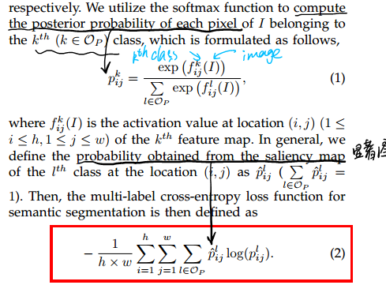

* [paper](paper/2016-STC%20A%20Simple%20to%20Complex%20Framework%20for%20Weakly-supervised%20Semantic%20Segmentation.pdf)
## 主要思想

作者的核心思想是提出了层层递进的三个DCNN，用前一个CNN的结果来作为下一个CNN的结果。

具体来讲，作者一共训练了三个网络：Initial DCNN、Enhanced DCNN和Powerful DCNN。分别解释如下：

- Initial DCNN：

  其实可以把它当作是一个有显著性检测功能的CNN，但“它”能够知道显著性的物体是什么。具体实现是由DRIF方法生成Saliency Map，再结合Image level label，来训练网络。

- Enhanced DCNN： 这一层主要是用来refine每一个物体的分割模版。由于I-DCNN在训练过程中，使用DRIF会有很大噪声，因此这时候就需要我们的“弱标签”出场了。 说白了，这个DCNN就是对上一个的一个refine。

- Powerful DCNN:

  有了上述简单图像的分割之后，我们需要对复杂的多目标的图像进行分割了，这时候，以E DCNN生成的结果作为P DCNN的GroundTruth来训练P DCNN。

### 贡献

* 我们提出了STC网络结构来有效实现弱监督学习；
* 引入多标签交叉熵损失函数以基于显着性映射训练分割网络，其中每个像素可以自适应地贡献具有不同概率的前景类和背景。

### 网络结构

### Initial-DCNN 

* 提出的损失函数

