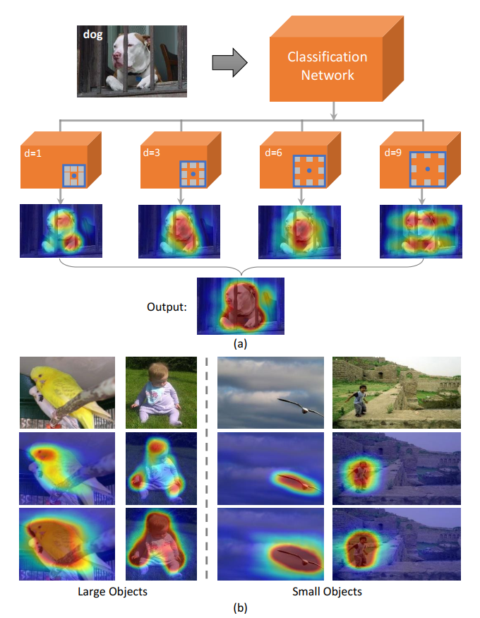
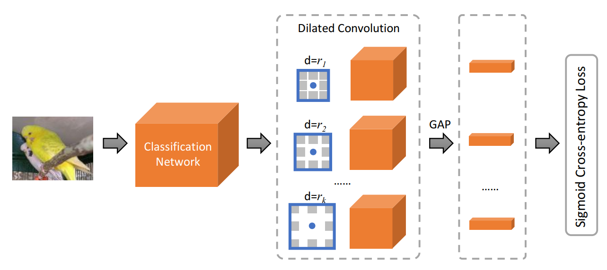
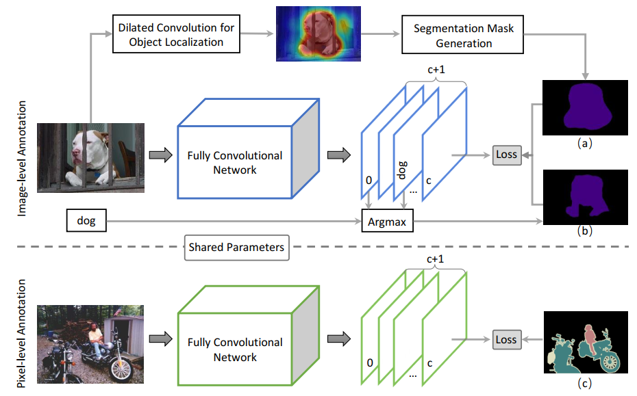
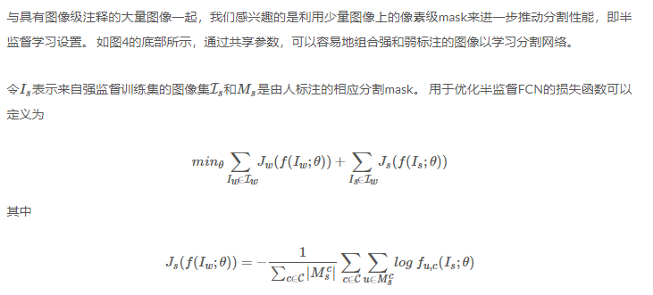

* [paper](paper/2018-Revisiting%20Dilated%20Convolution%20A%20Simple%20Approach%20for%20Weakly-%20and%20Semi-%20Supervised%20Semantic%20Segmentation.pdf)
## when

* 魏云超组的18年
* cvpr spot

### who

* 弱监督语义分割问题的新方法，用扩张卷积得到注意力图，可能能够在GAIN的大框架上面修改

## why 提出

- 尽管弱监督分割方法取得了显着的进步，但仍然不如全监督的方法。我们认为性能差距主要来自他们学习从图像级监督产生高质量密集对象定位图的限制。
- 为了弥补这种差距，我们重新审视了空洞卷积[1]并揭示了如何以一种新颖的方式利用它来有效地克服弱监督分割方法的这一关键限制。具体而言，我们发现不同的扩张率可以有效地扩大卷积核的感受域，更重要的是将周围的鉴别信息转移到非鉴别对象区域，促进这些区域在对象定位图中的出现。
- 然后，我们设计了一个通用的分类网络，配备了不同扩张率的卷积块。它可以生成密集可靠的对象定位图，并有效地受益于弱监督和半监督语义分割。尽管显而易见，但我们提出的方法获得了优于现有技术的优越性能。
- 特别是，它在Pascal VOC 2012测试集上实现了60.8％（弱监督设置，仅有图像级标签可用）和67.6％（半监督设置，1,464个分割mask可用）的mIoU得分，这是最先进的效果。

## where（适用范围，优点，缺点， 创新点，以前的方法）

### 出发点

* 弱监督的图像识别方法 [11, 15, 16, 19, 23, 38-42, 44]已被广泛研究，因为它们不需要昂贵的人力。 其中，最吸引人的是学习仅从图像级标注中分割图像。 对于这样的方法，可以说仍然未解决的最关键的挑战是如何准确和密集地定位对象区域以获得用于启动和改进分割模型训练的高质量对象线索[1, 20, 45]。

* 最近，一些自上而下的方法 [43, 46] 提出利用分类网络为对象定位产生特定于类的注意力线索。然而，直接采用由图像分类模型产生的注意力只能识别目标对象的小的鉴别区域，其对于训练良好的分割模型而言不够密集和广泛。例如，在图1（b）的第二行中示出了由现有技术的类激活映射（CAM）[46]产生的一些类特定区域定位的样本。可以观察到CAM在通常存在大对象的情况下几乎不产生密集对象区域，这偏离了语义分割任务的要求。 CAM发现的那些区域通常散布在目标物体周围，例如，一些鉴别性的部分，如孩子的头部和手部。无法学习从图像级监督产生密集对象定位是开发性能良好的弱监督分割模型的关键障碍。基于这样的观察，我们提出将鉴别知识从那些稀疏突出的区域转移到相邻的对象区域，从而形成密集的对象定位，这可以基本上有利地提升分割模型学习。

  

### 优点

* 为此，我们重新审视了流行的扩张卷积，并发现它确实提供了适当利用的有希望的解决方案。 扩张卷积最初由Chen等人 [1, 2] 引入，用于语义分割。 一个关键的优点是它可以有效地扩大感受野大小以结合上下文而不引入额外的参数或计算成本。 我们发现这样的特征很好地适合跨图像区域传播鉴别信息并突出显示非鉴别对象区域以产生密集对象定位。 由此推动，我们引入了多个扩张卷积块来增强标准分类模型，如图1（a）所示。

* 特别是，我们提出的方法通过改变卷积核的扩张率来扩展多尺度的感受域。 通常，分类网络能够识别具有高响应的一个或多个小鉴别部分以正确识别图像。 通过扩大感受野，具有低响应的物体区域可以通过感知周围的高响应环境而获得改善的鉴别力。 这样，目标对象的高响应部分的鉴别信息可以以多个尺度传播到相邻的对象区域，使得它们更容易被分类模型识别。 我们利用CAM [46]为每个卷积块生成对象定位图。 如图1（a）所示，卷积块只能定位两个小的鉴别区域而不扩大扩张率，即d = 1.通过逐渐增加扩张率（从3到9），发现了更多的物体相关区域。

* 然而，一些真正的负面区域可能以大的扩张率错误地突出显示（例如，对应于d = 9的定位图）。 然后，我们提出了一种简单而有效的抗噪声融合策略来解决这个问题。 该策略可以有效地抑制由放大的感受野激活的与物体无关的区域，并将由不同的扩张块产生的定位图融合成整体突出的物体区域。 从图1（b）所示的例子可以看出，我们的方法对于尺度变化非常稳健，并且能够密集地定位目标对象。

### 创新点

* 我们使用由我们提出的方法生成的定位图来生成用于训练分割模型的分割mask。 我们的方法是通用的，可以用于以弱监督和半监督方式学习语义分割网络。 尽管它显而易见，但我们的方法确实提供了密集的对象定位，可以轻松地将弱和半监督的语义分割推广到新的现有技术，如广泛的实验所示。 总而言之，这项工作的主要贡献有三方面：
  * 我们重新考虑了扩张卷积，并揭示它自然符合密集定位对象区域的要求，以构建一个良好的弱监督分割模型，这是弱/半监督图像语义分割的新方法。
  * 我们提出了一种简单而有效的方法，利用扩张卷积通过传递鉴别分割信息来密集定位对象。
  * 我们提出的方法对于以弱和半监督方式学习语义分割网络是通用的。 特别是，它在弱设置和半设置的Pascal VOC分割基准测试集上分别达到了60.8％和67.6％的mIoU评分，这是新的最新技术水平。

### 以前的方法

**使用粗略标注进行分割**
为训练语义分割模型收集大量像素级注释是消耗劳力型的。 为了减轻像素级注释的负担，Dai等人 [3] 和Papandreou等人 [21] 提出用标注边界框学习语义分割。 Lin等人 [17] 采用语义线作为语义分割的监督。 最近，监督的标注进一步放宽到[28]中的实例点。

**使用图像级标注进行分割**
图像级标签很容易获得，是倾向于分割的最简单的监督。一些研究 [22-24] 提出利用多个实例学习进行语义分割与图像级标签。 Papandreou等人 [21] 提出基于期望最大化算法动态预测前景物体和背景以进行监督。最近，在这项具有挑战性的任务上取得了很大进展 [8, 9, 13, 14, 26, 29, 31, 34, 35] 。 Wei等人 [35] 和Qi等人 [26] 利用生成用于监督的像素级标注。然而，利用MCG [25] 提出的采用额外的网络[36]进行基于候选的分类通常会导致大量的时间消耗，并且固有地使用更强的监督（MCG已经通过具有像素级注释的PASCAL训练图像进行训练） 。 Wei等人 [34] 提出了一种简单到复杂（STC）的框架，以逐步提高分割网络的能力。然而，STC的成功主要取决于大量简单的训练图像。 Kolesnikov等人 [14] 提出了一种SEC方法，它将三种损失函数（即种子，扩展和约束边界）整合到一个统一的框架中，以训练分割网络。但SEC只能获得用于监督的小而稀疏的对象相关种子，这无法为可靠的分割模型提供足够的信息。最近，Wei等人 [33] 提出了一种对抗性擦除（AE）方法来挖掘密集对象区域进行监督。尽管它在PASCAL VOC基准测试中实现了最先进的性能，但AE方法需要重复的训练程序来学习多个分类模型，然后将其应用于定位与物体相关的区域。相比之下，我们只需要训练一个分类模型来定位这项工作中的密集和整体对象区域。

## how

### 1. 重新审视空洞卷积

* 一些自上而下的方法 [43, 46] 可以识别有助于分类网络决策的鉴别对象区域，但是它们通常会错过非鉴别对象区域。我们提出通过使信息从鉴别区域转移到相邻的非鉴别区域来增强分类模型以克服这种限制。我们发现扩张卷积[1]可以通过扩大核的感受野大小来有效地结合周围环境，提供了一种很有前景的解决方案。图2说明了扩张如何实现信息传递。最初，绿圈中的头部区域对于分类网络来说是最具鉴别力的，以将其识别为“鸟”图像。我们采用3x3卷积内核在红圈指示的位置学习特征表示。通过将扩张率从3×3核的1扩大到3，将感知到头部附近的位置并且增强其鉴别力。通过进一步增加扩张率（即d=6,9），一些其他位置将感知头部并且类似地促进分类模型以发现这些区域。为了证明扩张卷积确实可以提高低响应对象区域的鉴别能力，我们使用CAM [46]以不同的扩张率产生定位图。我们可以观察到，d=1的定位图上的那些低响应对象区域可以用各种扩张率有效地突出显示。产生的定位图根据不同的扩张率互补，因此也需要来自多个扩张块的综合结果。

### 2. 用于定位的多扩张卷积

* 受上述发现的推动，我们提出了一个具有多扩张卷积块（MDC）的增强分类网络，以产生密集的对象定位，如图3所示。该网络建立在ImageNet预训练的VGG16 [32] 模型上 [4]。 我们删除那些全连接层和一个池化层以扩大特征图的分辨率。 然后，将具有多个扩张率（即d=ri，i=1,⋅⋅⋅,k）的卷积块附加到conv5，以定位由不同感受域感知的对象相关区域。 在全局平均池化层（GAP）之后，所产生的代表进一步通过全连接层来预测图像级别分类。 我们通过最小化sigmoid交叉熵损失来优化分类网络，然后使用分类激活图（CAM）[46] 方法来为每个块产生类特定的定位图。

* 我们实现了两种卷积运算。 
  1. 我们应用标准内核，即d=1。在这种情况下，我们可以获得精确的定位图，其中目标对象的一些鉴别部分被突出显示但是许多与对象相关的区域被遗漏。 
  2. 为了将稀疏突出区域的鉴别性知识转移到其他对象区域，我们改变扩张率以扩大核的感受域。 以这种方式，来自相邻突出显示区域的鉴别特征可以被转移到尚未被发现的对象相关区域。 我们观察到大扩张率的卷积块将引入一些不相关的区域，即通过利用相邻的鉴别对象部分突出显示的一些真正的负面区域。 因此，我们建议在这项工作中使用小的扩张率（即d=3,6,9）。

* 然而，即使我们采用小的扩张率，仍然可以识别一些不相关的区域。为了解决这个问题，我们提出了一种简单的抗噪声融合策略来抑制与物体无关的区域，并将生成的定位图融合成一个整体，其中对象区域被突出显示。我们注意到，真正的与物体相关的真实区域通常可以通过两个或更多个定位图来区分，真正的负面区域在不同的扩张下显示出差异。为了去除错的区域，我们对由不同的扩张卷积块（d=3,6,9）生成的定位图进行平均操作。然后，将平均定位图图添加到标准卷积块（d=1）的定位图中以产生最终的定位图。以这种方式，不会错过由标准卷积块挖掘的精确区域。形式上，我们使用H0和Hi（i=1···nd并且nd是扩张的卷积块的数量）来分别表示由标准和扩张的卷积块生成的定位图。然后通过H=H0+∑Hi产生用于对象区域生成的最终定位图H：

* 基于H，具有大于预定义阈值δ的值的像素被认为是前景支持对象相关区域。 此外，还需要背景定位提示来训练分割网络。 受 [14, 33, 34] 的启发，我们利用显着性检测方法 [37] 来生成训练图像的显着性图，并将具有低显着性值的像素作为背景。 我们遵循 [33] 中详述的相同策略来合并突出显示的对象区域和背景提示。 最后，我们能够获得每个训练图像的预测分割mask以便学习分割。

### 3. 弱分割学习和半分割学习

我们应用由所提出的方法产生的密集定位图来训练弱和半监督的分割模型。

#### 弱监督学习

于弱监督应用，我们采用与 [21,33] 中提出的类似的框架来利用推断的分割mask中的那些被忽略的像素并获得对错误标记的像素的鲁棒性，如图4的上部所示。 具体地，我们提取对应于真实情况的图像级标签的置信度图，用于以在线方式推断分割mask，其与从密集定位图导出的分割mask一起用作监督。

#### 半监督学习

## how much

### 数据集与设置

**数据集与评价指标**
所提出的方法在PASCAL VOC 2012分割基准[5]上进行评估。 在此数据集中标注了1个背景类别和20个对象类别。 按照惯例 [1, 6, 33]，通过增强训练图像的数量增加到10582。 验证和测试子集分别包括1,449和1,456个图像。 我们根据21个类别的mIoU来评估性能。 对于所有实验，仅使用图像级标签作为监督，并对验证集进行详细分析。 我们将我们的方法与验证和测试集上的其他最新方法进行比较。 通过将预测结果提交给官方PASCAL VOC评估服务器获得测试集上的结果。

**训练与测试设置**
我们采用在ImageNet [4]上预训练的VGG16 [32] 的卷积层来初始化分类网络，除了新添加的卷积块。对于分割网络，选择 [1] 中的DeepLab-CRF-LargeFOV模型作为基本网络，其参数也由VGG16初始化。我们采用30个图像的小批量大小。从图像中随机裁剪321×321像素的patch，用于训练分类和分割网络。我们训练模型15个epoch。初始学习率设定为0.001，并在6个epoch后减少10倍。所有实验均在NVIDIA TITAN X PASCAL GPU上进行。我们使用DeepLab [1] 代码，该代码基于公开的Caffe框架 [10] 实现。为了基于密集定位图获得对象相关区域，选择属于唯一最大值的前30％的像素作为对象区域。由 [37] 产生的显着性图用于提供背景线索。按照 [33] 的设置，我们将标准化显着性值小于0.06的像素设置为背景。训练时将忽略所有冲突和未分配的像素。

### 与现有方法的比较

#### 弱监督语义分割

对于弱监督语义分割，我们主要比较使用粗略像素级注释（包括线，边界框和点）和图像级注释作为监督信息的方法。 表1显示了PASCAL VOC验证集和测试集的比较。 注意，一些方法利用更多图像进行训练，即MIL-* [24]（700K），TransferNet [7]（70K），STC [34]（50K）和Hong等人 [8]（970K）。 此外，由于使用了MCG [25] 所提出的，一些方法（例如SN_B [35] 和AF-MCG [26]）隐含地使用了像素级监督。

从表1可以看出，从我们生成的密集定位图推断的分割mask对于学习分割网络是非常可靠的，其优于使用图像级标签作为弱监督的所有其他方法。我们注意到Hong等人 [8] 在这项具有挑战性的任务中取得了最先进的表现。但是，这种改进主要得益于使用额外的视频数据进行训练。由于视频中的时间动态可以提供丰富的信息，因此与静止图像相比，更容易区分整个对象区域和视频。值得注意的是，我们只使用10K图像来训练模型，该模型超过Hong等人 [8]在验证集上的表现2.3％。这很好地证明了所提出的方法在生成高质量密集对象定位图方面的有效性。 AE-PSL需要进行多个对抗性擦除步骤来挖掘与物体相关的区域，这需要训练多个不同的分类模型用于对象定位。所提出的方法仅需要训练一个单一的分类模型来定位对象区域并且获得比AE-PSL好得多的mIoU分数。与AF-MCG [26] 相比，我们的方法不需要大量的候选，因此提高候选的效率更高，并且对它们的训练非常耗时。在没有任何像素级监督的情况下，我们的弱监督结果进一步接近基于线和基于边界框的方法，并且超过基于实例点的方法超过8.8％。我们对PASCAL VOC测试集进行了额外的比较。我们的方法在这个竞争基准上实现了新的最新技术水平，并且超过其他人的mIoU分数2.1％。

#### 半监督语义分割

对于半监督语义分割，我们主要与WSSL [21] 进行比较，其中弱标注是图像级标签。 为了进一步验证密集定位图的质量，我们还与可以利用边界框进行监督的方法进行了比较。 我们采用与那些基准相同的强/弱拆分，即1.4K强注释图像和9K弱注释图像。

从表2可以看出，在相同设置下，我们的方法比WSSL获得更好的结果，即验证集为65.7％对64.6％，对于测试集为67.6％对66.2％。 此外，我们还与使用对象边界框作为弱监督信息而不是图像级标签的其他方法进行比较。 尽管我们的方法使用了较弱的监督，但它仍然分别在验证和测试集上实现了竞争性和更好的mIoU分数。

## why （为什么效果好）

### 密集对象定位策略

用于对象定位的所采用的分类网络通过具有多个扩张率的卷积块来增强。来自不同扩张块的对象相关提示可以集成到密集和整体对象区域中。为了验证这一点，来自不同卷积块的定位图样本和融合结果在图5中可视化。我们观察到块（d=1）能够以高精度但低召回率定位对象（目标对象的大多数区域错过了）。通过利用具有较大扩张率的其他块（d=3,6,9），一些其他与物体相关的区域被突出显示，例如，第一排猫右边的身体（d=6）和第二排的摩托车的一些部分（d=3和d=6）。然而，我们注意到，如果我们采用大的扩张率（例如，对应于d=6和d=9的那些定位图），也会突出显示一些真正的负面区域。例如，我们可以观察到地图中的中心区域（第5行，第6列）变得对类别狗有鉴别性。原因是当对中心像素进行卷积运算时，放大的核感知两只狗周围的环境，这提高了产生的卷积特征的鉴别能力。

图5.由不同扩张块产生的定位图的示例以及具有抗噪声融合策略的密集定位图。一行失败例子显示在底行。

可以观察到，正确的正面对象相关区域通常由两个或更多个定位图共享，并且错误的正面对象相关区域根据扩张率而不同。 为了防止与错误对象相关的区域被突出显示，我们对这些具有扩大的扩张率定位图进行了平均操作。 然后，我们将获得的定位图与由d=1的块产生的定位图相加以产生最终结果。 从图5中可以看出，即使对于一些具有挑战性的情况，例如多类和多实例，大多数对象区域都会在最终的融合定位图中突出显示。

此外，我们的方法值得强调的一个优点是，无论对象的大小如何，我们都可以根据生成的密集定位图轻松地使用固定阈值来准确获取大多数对象区域。 然而，如图1（b）和图5所示，很难使用固定阈值来精确地提取定位图的对象区域而不会扩大膨胀率（即d=1）。特别是，我们需要一个大对象的小阈值，以便发现大多数与对象相关的区域。 然而，小对象的值需要很大，以便可以禁止真正的负面区域。

我们在图5的底行显示了一个失败例子。该样本具有以下特征，即当d=1时，具有大规模的对象和仅在目标对象的一端稀疏突出显示的鉴别区域。在这种情况下 ，使用小的扩张率难以将鉴别力知识从物体的头端转移到尾端。 我们相信 [33] 中提出的诸如对抗性擦除等一些技术可能有助于解决这个问题。

### 弱监督语义分割

表3示出了使用由不同定位图产生的分割mask作为学习分割网络的监督的比较。我们观察到通过扩大卷积核的膨胀率逐渐改善了性能（从50.3％到54.4％），这可以进一步验证使用扩张卷积块进行物体定位的有效性。此外，基于所提出的抗噪声融合策略产生的密集定位图，mIoU得分可以进一步提高到57.1％，这可以进一步证明该策略在突出物体和消除噪声方面的有效性。请注意，我们还尝试通过平均来自所有卷积块（包括d = 1）的定位图来生成密集定位图。与使用当前的融合策略相比，mIoU评分下降近1％。此外，与使用一个块相比，使用具有相同扩张率（例如d = 1）的四个卷积块的mIoU没有显着改善。由于条件随机场（CRF）已被视为语义分割的标准后处理操作，并被所有先前的工作用于进一步提高性能，因此我们系统地使用CRF来细化预测的掩模，以便与其他最先进的方法进行公平比较。我们可以观察到，我们的方法最终可以分别在验证集和测试集上达到60.4％和60.8％的mIoU评分，并且优于所有其他弱监督方法。

### 半监督语义分割

表4示出了以半监督方式使用不同强/弱拆分用于倾斜分割网络的结果。我们观察到，通过将强图像的数量从1.4K减少到500，性能仅下降0.9％，这表明即使使用少量强图像，我们的方法也可以容易地获得可靠的分割结果。基于生成的密集定位图，我们在CRF后处理的验证和测试集上实现了最新的最新结果（基于1.4K强图像）。我们还在另一个使用2.9K强图像进行训练的环境中进行评估。我们可以看到相应的mIoU得分为68.5％，这与[21]中报告的相同。由于[21]和这项工作都基于相同的基本分割网络，因此当强标注图像的数量超过某个阈值时，性能可能会饱和。我们将图6中的一些预测分割mask可视化，这表明我们的方法可以获得令人满意的分割结果，其中几个甚至没有用于训练的强标注图像。

