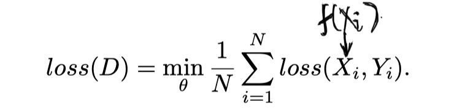
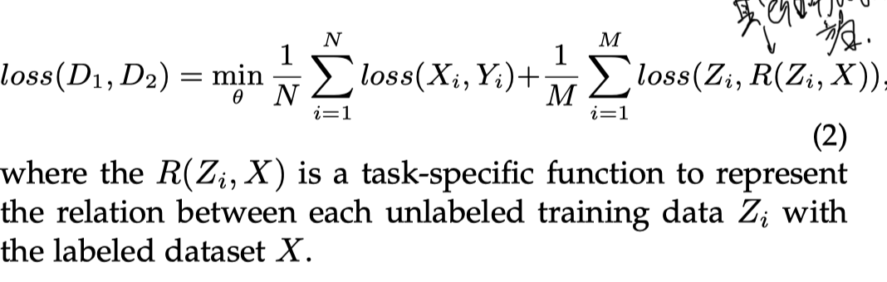
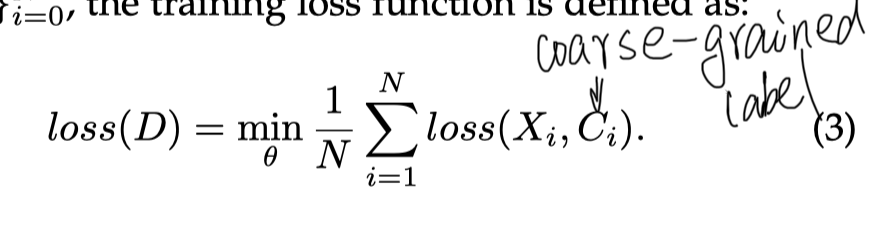
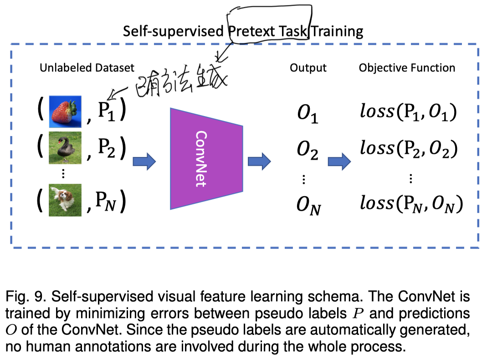
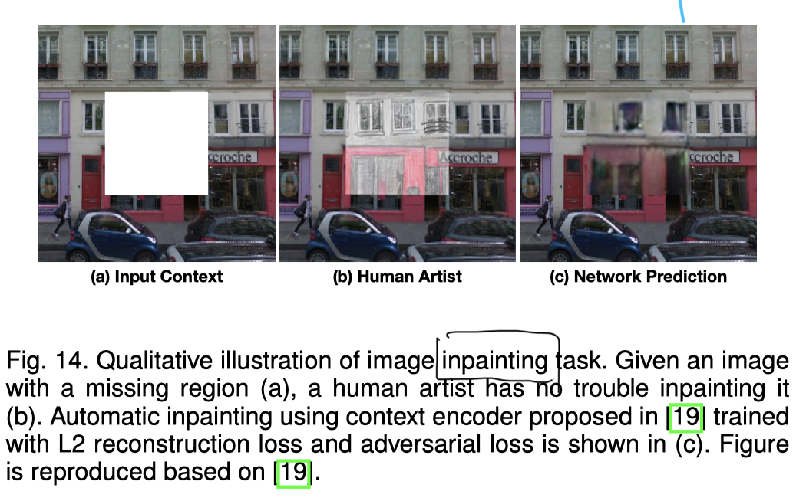

## who

* Longlong Jing and Yingli Tian ∗ , Fellow, IEEE
* 2019-

## what

* 为了避免收集和注释大规模数据集的大量成本，作为无监督学习方法的子集，提出了自我监督学习方法，以从大规模未标记数据中学习一般图像和视频特征，而无需使用任何人工标注的标签。

### 一些术语

#### 1. Pseudo label:

* 伪标签是基于pretext tasks的数据属性自动生成的标签。

#### 2. Pretext Task

* Pretext tasks 是网络要解决的预先设计的任务，通过学习Pretext tasks 的目标函数来学习视觉特征。

#### 3. Downstream Task

* 用于评估自我监督学习所学习的特征的质量。
* 需要人工标注的标签来解决Downstream Task。
* 在某些应用程序中，Downstream Task可以与Pretext tasks 一样不使用任何人工注释标签。

#### 4. Self-supervised Learning

* 无监督学习方法的一个子集。
* 学习方法，其中使用自动生成的标签明确训练ConvNets；

> **本综述仅关注视觉特征的自我监督学习方法**

## where

### 动机

#### 1. 经过预先训练的模型，并针对其他任务进行了调整，主要有两个原因

1. 从大规模不同数据集中学习的参数提供了一个很好的起点，因此，对其他任务的网络训练可以更快地收敛；
2. 在大规模数据集上训练的网络已经学习了层次结构特征，这有助于减少其他任务训练期间的过拟合问题，特别是当其他任务的数据集很小或者训练标签很少时。

#### 2. 要从未标记的数据中学习视觉特征

* 为了避免耗时且昂贵的数据标注；
* 一种流行的解决方案是提出网络要解决的各种pretext tasks，同时通过学习pretext tasks的目标函数来训练网络，并通过该过程学习特征。

#### 3. pretext tasks共享两个共同属性

1. ConvNets需要捕获图像或视频的视觉特征来解决pretext tasks，
2. 可以基于图像或视频的属性自动生成用于pretext tasks的伪标签。

### 整体思路框架

###  创新

1. 据我们所知，这是第一个关于深度ConvNets的自我监督视觉特征学习的全面调查，这将有助于该领域的研究人员。
2. 深入审查最近开发的自我监督学习方法和数据集。
3. 提供了定量性能分析和现有方法的比较。

### 不同学习方法的函数

#### 1. 监督学习函数

#### 2. 半监督学习函数

#### 3. 弱监督学习函数

#### 4. Self-supervised Learning

* 自我监督学习也用数据$$X _{i}$$及其伪标签$$p_{i}$$训练，而$$p_{i}$$是为预先定义的Pretext tasks自动生成的，不涉及任何人类注释。
*  伪标签$$p_{i}$$可以通过使用图像或视频的属性来生成，例如图像的上下文，或者通过传统的手工设计方法。

## how

###  从Pretext任务学习视觉特征

* 整体架构

* 步骤
  1. ConvNets和视觉特征可以通过完成这个pretext task来学习到。
  2. 可以在没有人类标注的情况下自动生成用于pretext task的伪标签P.
  3. 通过最小化ConvNet O和伪标签P的预测之间的误差来优化ConvNet；
  4. 在完成pretext task的训练之后，获得可以捕获图像或视频的视觉特征的ConvNet模型。

### 一般的pretext task

#### 1. 基于生成的方法

* Visual features are learned through the process of image generation tasks. 
* This type of methods includes
  *  image colorization [18], 
  * image super resolution [15], 
  * image inpainting
  *  image generation with Generative Adversarial Networks (GANs) 

#### 2. Context-based pretext tasks

* Context Similarity
  * image clusteringbased methods 
  *  graph constraint-based methods 
* Spatial Context Structure
  * image jigsaw puzzle 
  * context prediction 
  * geometric transformation recognition

### Commonly Used Downstream Tasks for Evaluation

* 为了通过自我监督方法评估学习图像或视频特征的质量，采用自我监督学习的学习参数作为预训练模型，然后对Downstream Tasks进行调整，如图像分类，语义分割，

#### 1. 选择图像分类作为Downstream Tasks来评估从自我监督学习方法中学习的图像特征的质量

* 自我监督学习模型应用于每个图像以提取特征，
* 然后用于训练分类器，如支持向量机（SVM）

#### 2. e.g.  image colorizaion任务 

- 将灰度图像着色为彩色图像的任务。
- the data X is the 通过RGB图像线性变换得来的gray-scale images；

- pseudo label P is the RGB image itself.
- 对于图像分类任务的学习过程

### IMAGE FEATURE LEARNING

#### 1. Generation-based Image Feature Learning

* Image Generation with GAN

* Image Generation with Inpainting

#### 2. Context-Based Image Feature Learning

* 簇在特征空间中具有较小的距离，并且来自不同簇的图像在特征空间中具有较大的距离。
* 可以训练ConvNet使用群集分配作为伪类标签对数据进行分类。

### Performance of Image Feature Learning

1. 训练pretext task，得到网络的特征：
   * 使用AlexNet作为基础网络训练ImageNet数据集，而不使用类别标签。
2. 处理down stream任务得到评估结果；
   * 在ImageNet的训练中，在ConvNet的不同冻结卷积层上训练线性分类器；

* 得到三个结论
  1. 来自不同层次的特征总是受益于自我监督的前期任务训练。 自我监督学习方法的表现总是优于从头开始训练的模型的表现。
  2. 所有自我监督的方法都能很好地利用conv3和conv4层的特性，同时使用conv1，conv2和conv5层的特性表现更差。 这可能是因为浅层捕获了一般的低级特征，而深层捕获了与任务相关的特征。
  3. 当用于pretext task训练的数据集与down stream的数据集之间存在域差距时，自监督学习方法能够与使用ImageNet标签训练的模型达到相当的性能。