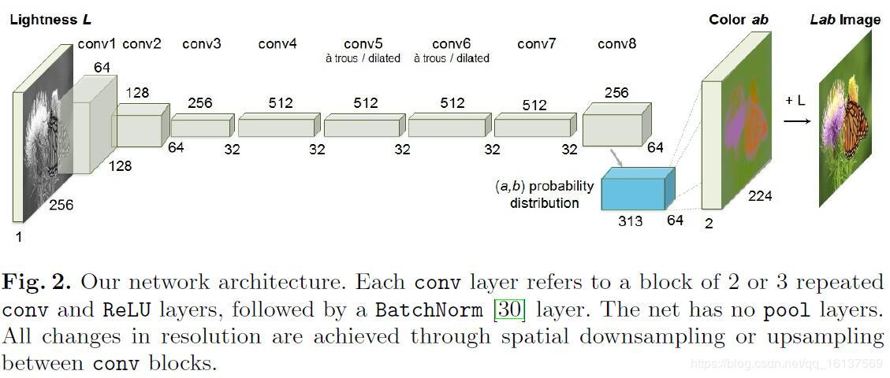
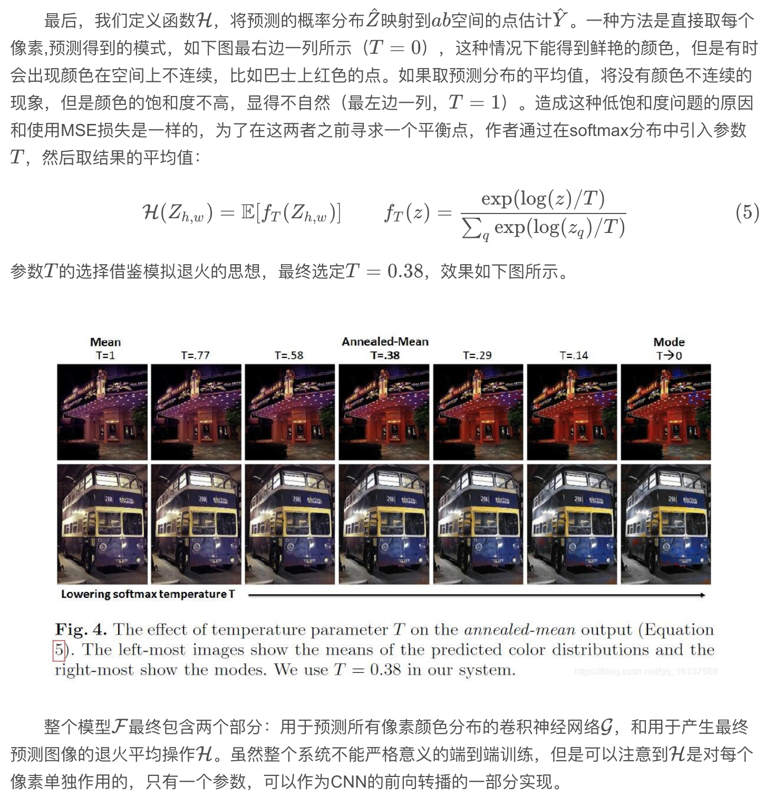

## what

* 论文的工作是灰度图的自动着色；

## who

* 这篇论文是加里福利亚大学Richard Zhang发表在ECCV 2016上的文章，
* [paper](paper/04.141-16-Colorful-Image-Colorization.pdf)

### 参考文献

* [Colorful Image Colorization](<https://blog.csdn.net/qq_16137569/article/details/83859156>)

## where

### 贡献

用论文作者自己的话说，论文贡献主要体现在两方面：

* 在自动图像着色的图形学领域取得了进步：设计了一个合适的损失函数来处理着色问题中的多模不确定性（简单来说就是物体可以有多种可能的上色），维持了颜色的多样性；介绍了一种新型的着色算法评估框架，而且这种评估框架有应用到其他图像合成任务的潜力；通过在百万数量级的彩色图片上训练在这类任务上抵达了一个新的水准。

* 将图像着色任务转化为一个自监督表达学习的任务，并且在一些基准上获得了最好的效果。

* 论文所做的事情用一句话就能概括：给灰度图上色。不过论文的切入点我觉得很巧妙，它不是恢复灰度图的真实颜色，而是用灰度图中物体的纹理、语义等信息作为线索，来预测可能的上色，最后的上色结果只要真实即可。这不仅降低了上色的难度，而且也符合人们的认知：比如一个苹果，给它上青色，上红色都是正常的，不限于某一个颜色，只要不是紫色黑色等奇怪的颜色。

### 动机

* 考虑到这篇论文是发表于2016年，当时图像着色方面的工作还不是很多，已有的方法比如ICCV 2015的《Deep colorization》，可以看到下图中的上色结果，虽然大体上正确，但是颜色显得饱和度比较低，有些单调的感觉。Richard Zhang认为，前人的目标只是优化预测结果和真实图片间的欧氏距离（即MSE），这种损失函数会鼓励比较保守的预测（原因在后面会将），从而导致颜色饱和度不高，色彩不丰富。

* 《Very deep convolutional networks for large-scale image recognition》这篇文章指出，颜色预测是一个多模的问题，一个物体本来就可以上不同的颜色。为了对这种多模性建模，Richard Zhang为各个像素预测一个颜色的分布，这可以鼓励探索颜色的多样性，而不仅仅局限在某一种颜色中。

## how

### 论文模型

* 基本模型还是比较简单的，输入图片的L 通道，使用一个CNN预测对应的ab通道取值的概率分布，最后转化为RGB图像结果。网络模型这里不存在什么难点，下面着重看一下作者是怎么设计损失函数的。

### 损失函数

### 分类再平衡

### 分类概率到点估计



 

## how much

* 这篇论文的实验设计的还是蛮精心的，这里来好好学习一下

### 上色质量评估

### 自监督特征提取的交叉通道编码

  为了进一步说明上色对于图形学任务的重要地位，作者解释了上色是如何作为表达学习的一种pretext task。这部分就不详细说了，作者就是把上色网络编码器的权重固定，然后重新训练成为一个分类、分割、识别网络，来检验这个上色网络特征学习的能力。