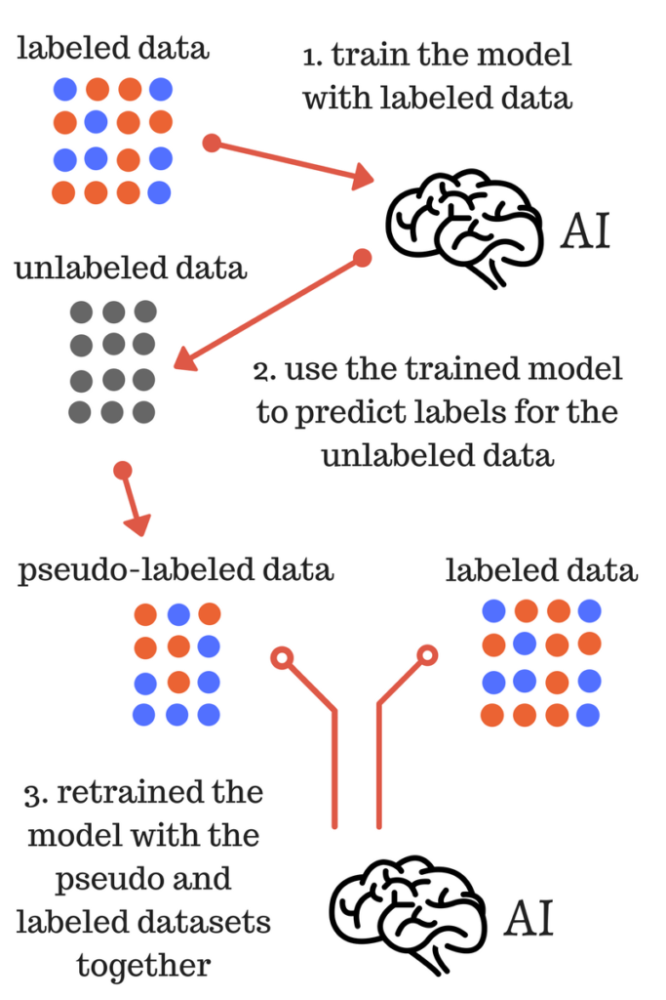

## who

### 参考文献

* [【译文】伪标签学习导论 - 一种半监督学习方法](<https://zhuanlan.zhihu.com/p/29886875>)

## what

* 伪标签学习也可以叫简单自训练（simple self-training）：用有标签数据训练一个分类器，然后用这个分类器对无标签数据进行分类，

这样就会产生伪标签（pseudo label）或软标签（soft label），挑选你认为分类正确的无标签样本（此处应该有一个挑选准则），把选出来的无标签样本用来训练分类器。

 

* 上图反映的便是简单的伪标签学习的过程，具体描述如下：

  i) 使用有标签数据训练模型；

  ii)使用训练的模型为无标签的数据预测标签，即获得无标签数据的伪标签；

  iii) 使用(ii)获得的伪标签和标签数据集重新训练模型；

* 最终的模型是(iii)训练得到，用于对测试数据的最终预测。

* 伪标签方法在实际的使用过程中，会在(iii)步中增加一个参数：采样比例（sample_rate），表示无标签数据中本用作伪标签样本的比率。

* 伪标签方法的更加详细介绍以及Python实现可以最后的参考文献。

## why

* 我们只有分属两个类别的两个数据点，途中的线代表着任意有监督模型的决策边界。

* 现在，让我们再途中加一些无标签数据，如下所示。

如果我们注意到两幅图的差异，我们就可以发现有了无标签数据后，两个类别的决策边界变地更加精确了。

因此，使用无标签数据的优点如下:

1. 有标签数据往往意味着高成本和难以获得，但无标签数据量大又便宜。
2. 通过提高决策边界的精确性，它们能提高模型的稳健性。

现在，我们对于半监督学习已经有了直观的认识，当然这个领域也有许多种方法，本文就介绍其中的伪标签学习法。