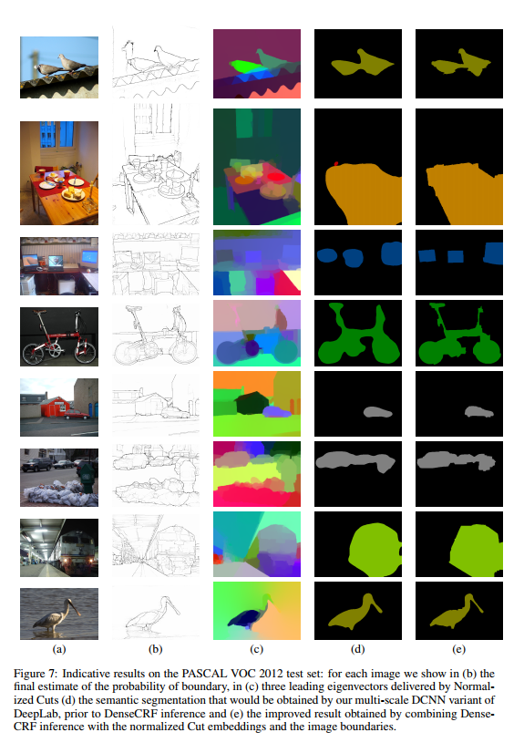

## 探究特征融合，多尺度信息来优化细节信息

### 多尺度
* 输入上的多尺度
* 中间层特征融合，多尺度。

#### 《Rich feature hierarchies for accurate object detection and semantic》
* [paper](paper/2013-Rich%20feature%20hierarchies%20for%20accurate%20object%20detection%20and%20semantic%20segmentation.pdf)
* 主要用于目标检测
    * 提取推荐框
    * 利用CNN特征提取
    * 利用SVM分类

#### 《Attention to Scale: Scale-aware Semantic Image Segmentation》
* [paper](paper/2016-Attention%20to%20scale%20Scale-aware%20semantic%20image%20segmentation.pdf)
* 关键：
    * 多个尺度图片训练
    * 得到的特征再学习一个特征融合时候的加权值，然后融合，不是直接相加的方式融合。
    * 这里学习每个像素点的加权值采用了注意力模型。

#### 《Pushing the Boundaries of Boundary Detection using Deep Learning》
* [paper](paper/2015-Pushing%20the%20Boundaries%20of%20Boundary%20Detection%20using%20Deep%20Learning.pdf) \

* 关键：
    * 每层构架一个子网络，
    * 每层输出一样大小，这样最后融合的时候，每个层子网络和输出层特征图可以每个像素点加权。  \
    
    

### 空间金字塔架构的多尺度

#### 《Beyond Bags of Features: Spatial Pyramid Matching for Recognizing Natural Scene Categories》
* [paper](paper/2006-Beyond%20Bags%20of%20Features%20Spatial%20Pyramid%20Matching%20for%20Recognizing%20Natural%20Scene%20Categories.pdf)
* 没看， 特征提取方法，太早了

#### 《Spatial pyramid pooling in deep convolutional networks for visual recognition》
* [paper](paper/2014-Spatial%20pyramid%20pooling%20in%20deep%20convolutional%20networks%20for%20visual%20recognition.pdf) \

* 关键
    * 金字塔池化：输入任意尺寸，输出固定尺寸。
    * 通过金字塔池化模型， 取消对输入的限制， 这样同一个网络就可以获得多尺度的输入，然后端对端训练。
    * 对不同尺度目标， 不同尺度的输入会有不一样的结果。
    * 金字塔池化也会保留空间信息， 因为每个池化后的结果位置是知道的。
    
    
    
### 反卷积方式

#### 《Learning Deconvolution Network for Semantic Segmentation》
* [paper](paper/2015-Learning%20Deconvlution%20Network%20for%20Semantic%20Segmentation.pdf)
* 一种提高输出分辨率的解决方案
* 提出一种解卷积和上采样方式，组合的方式，逐层提高输出的分辨率，
* 然后可以融合多个模型，也就是获得多个输出然后根据求和获得每个像素点是某类别的概率值，然后定义该像素。
* 缺点：
    * 没有论证为什么这种方式有效，只是通过实现结果说明了这个效果。