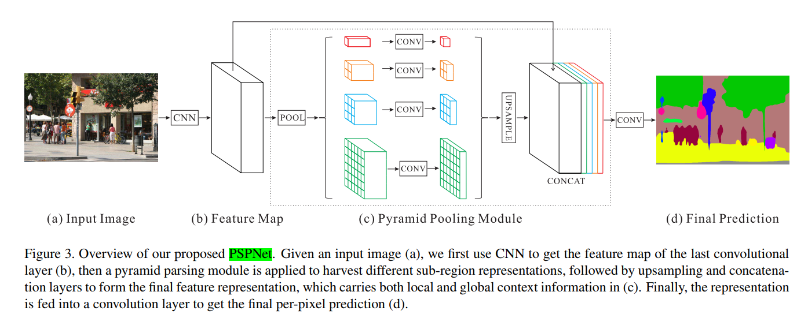

## PspNet

* [paper](paper/2017-Pyramid%20Scene%20Parsing%20Network.pdf)
* [github code](https://github.com/jiye-ML/Semantic_Segmentation_PspNet.git)

* 提出金字塔池化模块帮助实现背景聚合。
* 使用辅助损失（auxiliary loss）。

* 相关解释：
    * 全局场景分类为分割的类别分布提供线索，因此很重要。金字塔池化模块（Pyramid pooling module）
    通过应用较大核池化层的获取这些信息。如上文中空洞卷积论文中所述，PSPNet 也使用空洞卷积改善 ResNet，
    并添加一个金字塔池化模块。该模块将 ResNet 的特征图与并行池化层的上采样输出结果连接起来，其中卷积核核覆盖了图像的全部、一半和小块区域。
    * 在 ResNet 的第四阶段之后（即输入到金字塔池化模块），在主分支损失之外又增加了附加损失。这个想法在其他研究中也被称为中间监督（intermediate supervision）。

