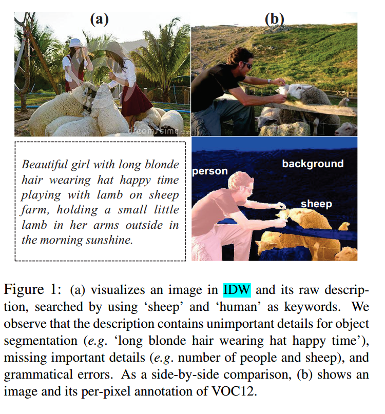
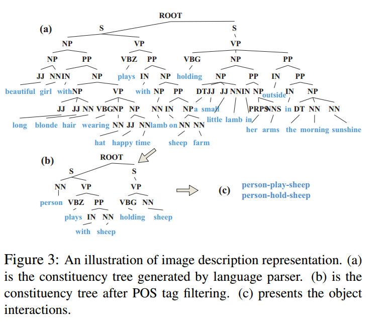
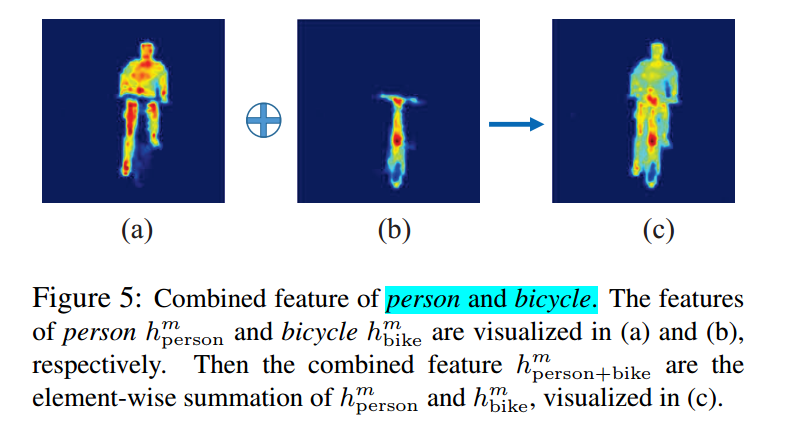
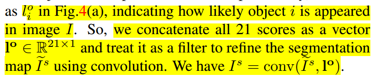

* [paper](paper/2017-Learning%20Object%20Interactions%20and%20Descriptions%20for%20Semantic%20Image%20Segmentation.pdf)

### 动机

* 本文主要是从训练数据的角度来提升CNN分割性能的。由于像素级别标记的样本很少，制作样本成本高。
* 这里直接根据关键词从网络上搜索相关图像，建立了一个数据库 IDW， 结合 VOC12上面的训练数据联合训练，对此设计了一个 IDW-CNN 模型，经过联合训练得到的模型用于分割，性能提升比较大。

### 贡献

1. 这是首次将图片描述在不经过手动处理和提炼的情况下用于提高语义分割性能的尝试，IDW数据集包含40k图片；
2. DIW-CNN提出来联合学习VOC12和IDW知识，两个数据集知识完全被探索并且互相迁移；分割和对象交互预测的表现在两个数据集上的都得到了提升。
3. IDW-CNN有能力稳定提高语义分割性能，当更多数据添加到IDW中时，体现了它的大场景下的应用潜力；

### 方法

* 图片和描述在IDW种是自动下载从Internet，不需要人工清洗和提炼，
* IDW_CNN提出来联合训练IDW和已经存在的VOC数据；
* 这里有两个性质：
  1. 来自不同数据库的只是可以被完全探索，并且互相转换来提高性能；
  2. 分割准确率在VOC中可以提高当选择更多的VOC数据的时候，
* 初步认识IDW和VOC数据

#### Learning Image Descriptions 

* 语义树

* 转换过程分为三步：
  1. 我们首先通过它们的词性过滤叶节点，仅保留名词作为候选对象，并将动词和介词保留为动作候选。
  2. 名词被转换为对象。 我们使用WordNet 中的词汇关系数据来统一同义词。 那些不属于20个对象类别的名词将从树中删除。
  3. 动词也应该被认可和完善。 我们使用word2ve将动词映射到定义的21个动作。最后，我们通过节点从语义树中提取对象交互。

### 网络结构（ IDW-CNN）

* 整体架构

#### 1. 整合网络分为3步

1. 我们通过卷积层将特征信道的数量从2048减少到512，表示为h，以便减少后续阶段的计算。之后，我们产生21个对象特征图的集合，表示为{hi^m},i表示21类中的一类，每个{hi^m}通过在h和每个语义分割预测通道的元素级乘法获得；

2. 在第二阶段中，每个{hi^m}被用作训练相应对象子网的输入，其输出表征对象i是否呈现在图像I中的概率。所以这里有21个子网络，参数不共享，但是在全连接层参数共享。
3. 我们训练22个action nets，每个网络预测两个对象的行为，

#### 2. Object-Pair Selection (OPS)  

#### 3. Refinement 

### 训练

* IDW-CNN联合IDW和VOC12的训练图片通过BP过程。

#### 1. Backwards of Seg-stream  

* softmax语义分割的输出和groundtruth

#### 2. Backwards of Int-stream 

* 包含两部分损失
  1. 每个对象subnet训练通过1-of-2 softmax损失决定一个特别的对象是否在图片中出现，
  2. 每个action net产生一个response，一共22中response，然后整个action网络优化1-of-22 softmax损失，最大的响应表示真实action在这两个对象间，

* 对于IDW，真实标签和动作都可以获得，上面带有一横的就是监督信息。所以可以很容易通过BP训练，

