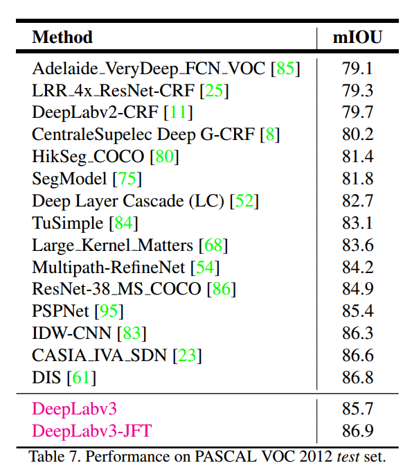

* [paper](paper/10.130-17-Rethinking-Atrous-Convolution-for-Semantic-Image-Segmentation.pdf)
* deepv3 利用两种级联空洞方法
  - 串行级联
    - 可以增加感受野，不损失空间信息，不增加参数
    - 缺点很明显，后面曲线图显示，随着rate的增加，效果变得不好，
  - 并行级联
    - 所以后面采用并行级联的方式，融合信息。
* 
* 
* 

