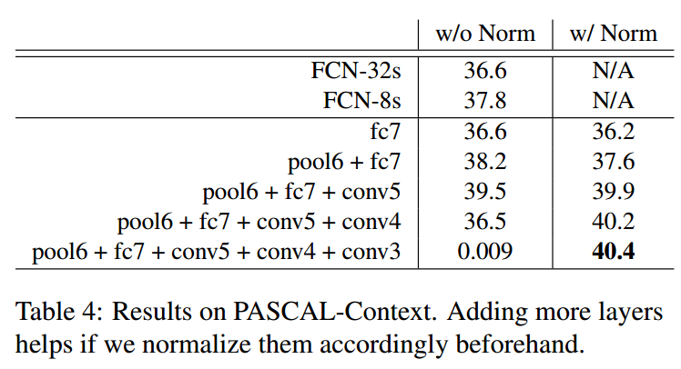
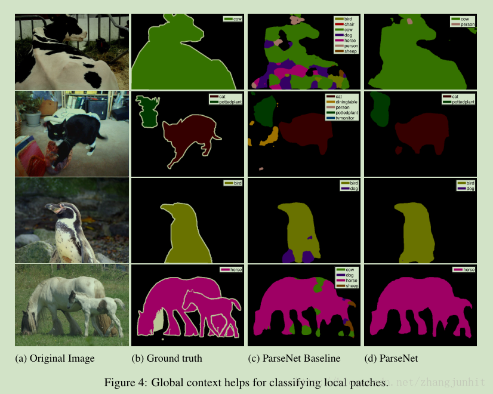

* [paper](paper/13.201-15-ParseNet-Looking-Wider-to-See-Better.pdf)

#### 动机

* 本文主要在语义分割问题中引入 global context 信息来提升分割精度
  * 首先指出 FCN 丢弃了全局信息 ;
  * 其他方法尝试引入更多的 context 信息，但是都比较复杂，计算量也比较大。
  * 这里我们首先想到了 global context，毕竟在整体中看待局部问题更清晰 ；

#### 假设

* 感受野对分类有好处，
* 理论上高层特征有大的感受野，但是在实际上只有理论的25% 的感受野大小。

#### 我们的工作

- 尽管在理论上网络的顶层特征具有很大的感受野，例如使用 VGG特征的 FCN 的 fc7 有 404 × 404 感受野。但是我们发现实际的感受野比这个小很多。这里我们使用了一个滑动随机噪声块的方法来确定合适的感受野。

* 有了 global context feature 和 FCN 中的 local feature map，这里需要把这两个特征融合，有两个选择：early fusion，late fusion，对应分类前融合，分类后融合。early fusion 相对简单一些。考虑到将多个不同的 scale and norm 特征向量融合起来，这里需要做归一化，我们采用了 L2 norm layer；

#### 网络框架

* l2层特征加入到不同层中，效果表现。

* 为什么需要l2，因为在融合的时候不同特征层的特征有不同的scale：

  

#### 实验效果

* 有帮助的情况

  

* 有负作用的情况

