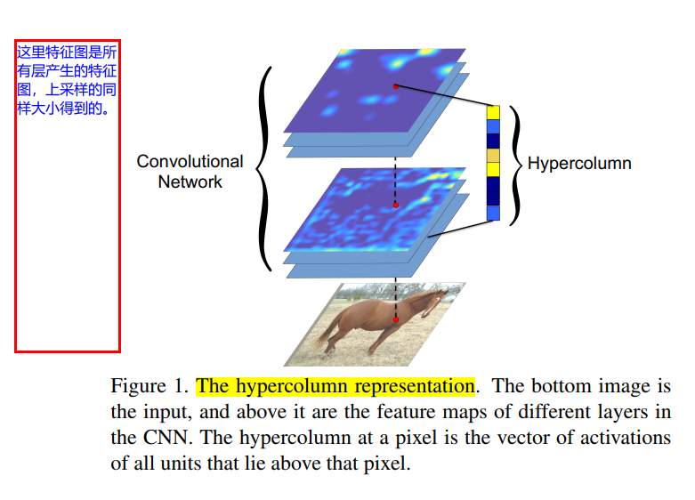

### 《Hypercolumns for Object Segmentation and Fine-grained Localization》
* [paper](paper/13.302-15-Hypercolumns-for-Object-Segmentation-and-Fine-grained-Localization.pdf) 
  
* 关键：
    * 提取每层的特征，上采样的一样大小和输出
    * 对应点所有的特征图上的和构成最终某一点的输出

* 网络结构

