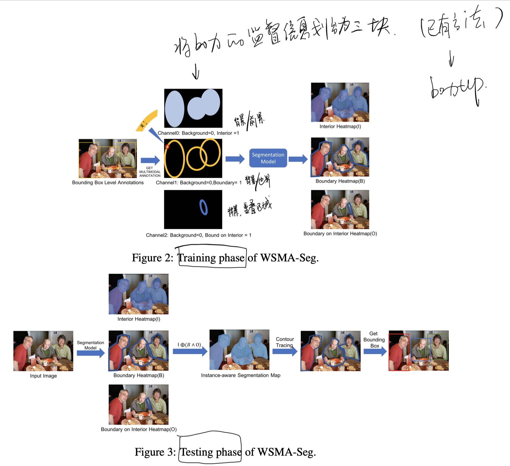
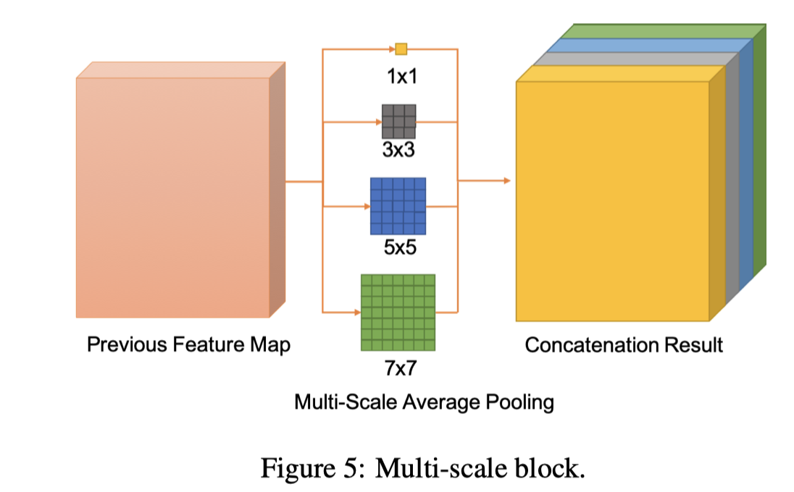
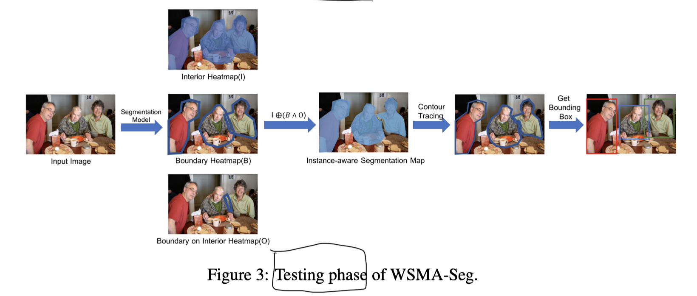

* [paper](paper/14.404-19-Segmentation-is-All-You-Need.pdf)

## when

- CVPR 2019

## what

- 使用以前的方法将box的监督信息转换为三个监督信息；
- 利用得到的三个监督信息训练网络
- 测试阶段输入原图，得到三个热力图，然后颜色追踪，最后得到box

## who （动机）

- Pixel-level segmentation annotations
  - much more representative than bounding box annotations,
  - creating well-designed pixel-level segmentation masks is very time-consuming, which is about 15 times of creating bounding box annotations
- in this work
  - automatically convert bounding box annotations to segmentation-like multimodal annotations,
- geometric segmentationlike”
  - the multimodal annotations are not strict segmentation annotations; rather, they are annotations generated from simple geometries,
  - 这个方法以及存在，参见论文《Boxsup:Exploiting bound boxes to supervise convolutional networks for sematic segmentation》

## where

### 1. 以前的工作的问题

### 2. 创新

* It consists of two phases
  * a training and a testing phase.
* training phase,
  * WSMA-Seg first converts weakly supervised bounding box annotations in detection tasks to multi-channel segmentation-like masks, called multimodal annotations;
  * a segmentation model is trained using multimodal annotations as labels to learn multimodal heatmaps for the training images.
* In the testing phase
  * resulting heatmaps of a given test image are converted into an instance-aware segmentation map based on a pixel-level logic operation;
  * a contour tracing operation is conducted to generate contours for objects using the segmentation map
  * bounding boxes of objects are created as circumscribed quadrilaterals of their corresponding contours.

### 3. advantages

* as an NMS-free solution, WSMA-Seg avoids all hyperparameters related to anchor boxes and NMS; so, the above-mentioned threshold selection problem is also avoided;
* the complex occlusion problem can be alleviated by utilizing the topological structure of segmentation-like multimodal annotations; 
* multimodal annotations are pixel-level annotations; so, they can describe the objects more accurately and overcome the above-mentioned environment noise problem.

### 4. contributions

* We propose a weakly supervised multimodal annotation segmentation (WSMA-Seg) approach to achieve an accurate and robust object detection without NMS, which is the first anchor-free and NMS-free object detection approach.
* We propose multimodal annotations to achieve an instance-aware segmentation using weakly supervised bounding boxes; we also develop a run-data-based following algorithm to trace contours of objects.

## how

### 1. Generating Multimodal Annotations

* 利用以前论文的方法，和一些几何技巧变换监督信息

### 2. Multi-Scale Pooling Segmentation

* 利用得到三种监督信息训练网络

* 训练阶段过程

* multi-scale-block

  

### 3. Object Detection Using Segmentation Results and Contour Tracing

* 测试阶段过程
  * 先利用网络得到三种热力图
  * 然后利用集合运算的到实例结果
  * 利用颜色追踪方法得到每个实例的边界，
  * 最后得到框

* 颜色补全示意图

* Run-data-based following algorithm

## how much

## why （为什么好）

* 利用了更多的监督信息