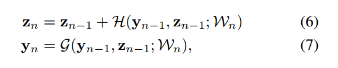
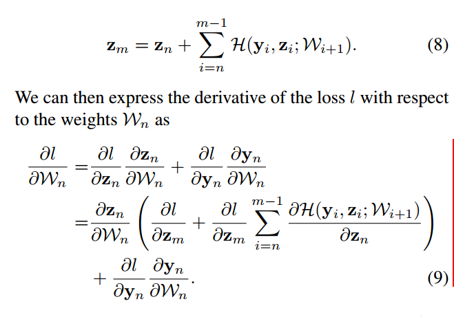
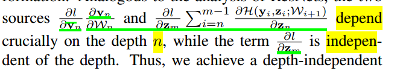
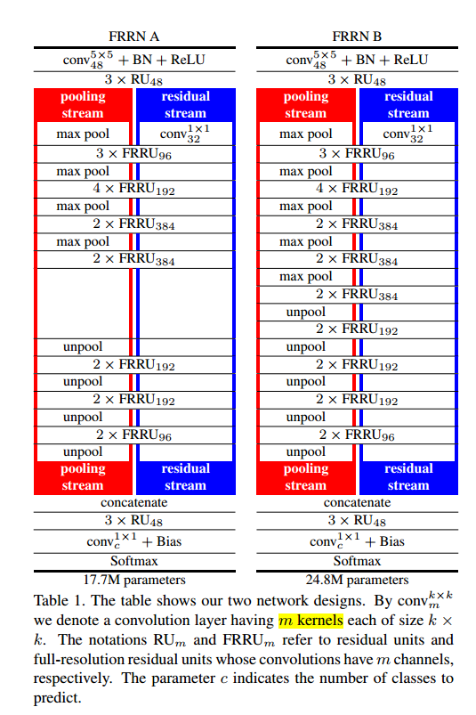

* [paper](paper/2017-Full-Resolution%20Residual%20Networks%20for%20Semantic%20Segmentation%20in%20Street%20Scenes.pdf)
* [github code](https://github.com/jiye-ML/Semantic_Segmentation_FRRN)

## 论文阅读

### abstract

为了像素级分类，需要保存全部的分辨率。我们提出ResNet-like架构的网络，来完成这样一个过程。两条流。
1. 全像素获得分割边界
2. pooling操作获得更鲁棒的识别特征
3. 71.8% on the Cityscapes dataset 

### 1. introduction

* pooling操作两个原因：

1. 增加感受野
2. 提高小变形的鲁棒性。

* 三种解决方案

1. 使用反卷积
2. 使用空洞卷积
3. 使用CRF后处理

* 主要贡献： 提出新网路架构两个流

  1. 保留全像素
  2. 采用pooling增加感受野

* 下面是三种网络模块的过程图

  

* 下面是FRRU模块的结构
  * 第二个卷积单元一两种方式使用，
    1.  form pooling后的FRRU单元，作为下一层的输入。
    2.  计算残差充当偏置

* 下面是FRRU模块的公式

  

* 下面是FRRU模块的反向传播

* 对于上面公式的解读，可以看下面，公式中有些依赖于n，有些不依赖于n，这就是残差连接的优势，可以防止梯度下降。

* FRRN两种结构示例

* 损失函数

  

* 损失函数k值选择

