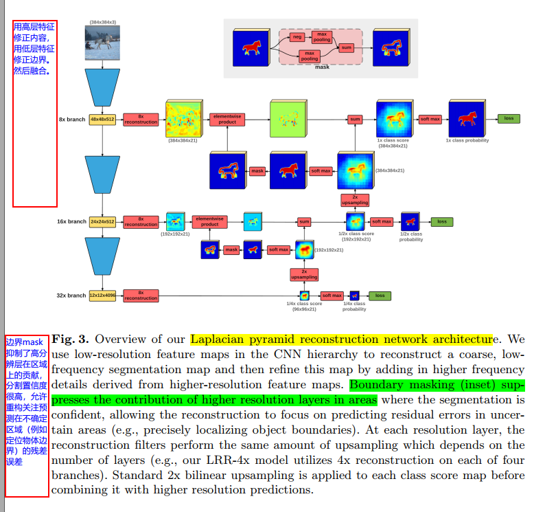

#### 《Laplacian Pyramid Reconstruction and Refinement for Semantic Segmentation》
* [paper](paper/2016-Laplacian%20Pyramid%20Reconstruction%20and%20Refinement%20for%20Semantic%20Segmentation.pdf)

* 贡献：
    1. 使用class-specific重构偏置来上采样子像素信息
    2. 多尺度重构架构，使用多个门来更有效混合有丰富分割信息的低分辨特征预测和空间细节的高分辨特征图;
* 论文很难，基本没看懂多少。