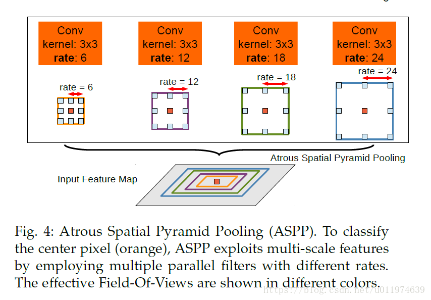
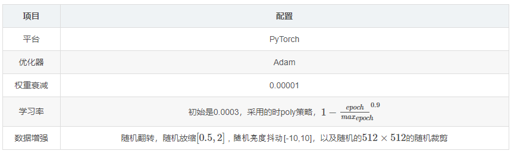
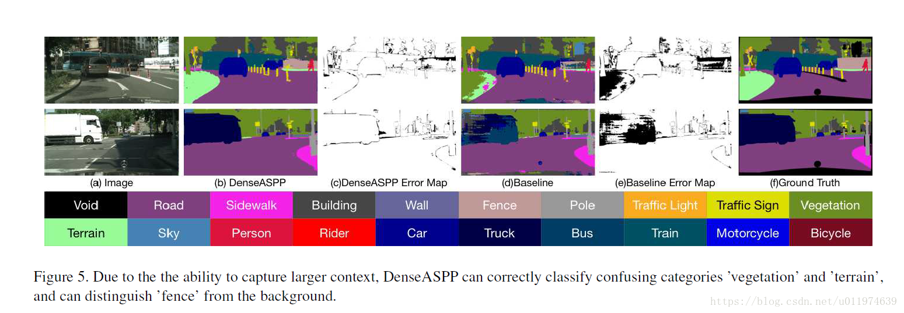
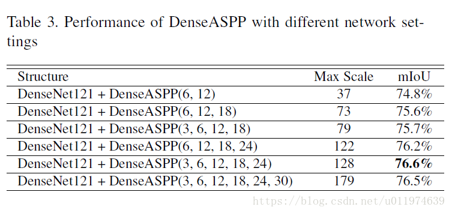

- [paper](paper/2018-DenseASPP-for-Semantic-Segmentation-in-Street-Scenes.pdf)

## when

- CVPR 2018

## what

* 使用扩张卷积(Atrous Convolution)能够在不牺牲特征空间分辨率的同时扩大特征接收野，DeepLab系列工作结合多尺度信息和扩张卷积的特点提出了ASPP模块，将不同扩张率的扩张卷积特征结合到一起。
* ASPP模块在尺度轴上特征分辨率还不够密集，获取的接收野还不够大，
* 为此提出了DenseASPP(Densely connected ASPP)，以更密集的方式连接一组扩张卷积，获得了更大的范围的扩张率，并且更加密集。
* 在没有显著增加模型大小的情况下，DenseASPP在CityScapes上达到了State-of-the-art的表现。

## who （动机）

- 扩张卷积用于解决特征图分辨率和接收野之间的矛盾，ASPP利用了多尺度信息进一步强化了分割效果。[DeepLabv2](https://blog.csdn.net/u011974639/article/details/79138653)中的ASPP模块如下：

  

  - 但是在自动驾驶等领域有高分辨率的输入，ASPP为了获取足够大的感受野需要足够大的扩张率，但随着扩张率增加(d>24)，扩张卷积的衰退衰减无效了([DeepLabv3中分析过这个问题](https://blog.csdn.net/u011974639/article/details/79144773#t7))。

- DenseNet

  - DenseNet中用密集连接获得更加的性能：

  

  * 但因为密集连接，特征的通道数会急速上升，**DenseNet中使用1×1的卷积用于降低通道数，限制了模型大小和计算量，同样的，在本文中也使用了多个1×1卷积用于降低参数，限制计算量**。

- DenseASPP

  - 论文提出的DenseASPP用于解决街道场景的尺度挑战，DenseASPP包含了一个基础网络，后面接了一个多级的扩张卷积层，如下图所示：

    

  - 使用密集连接的方式将每个扩张卷积输出结合到一起，**论文使用了较合理的扩张率(d<24)，通过一系列的扩张卷积组合级联，后面的神经元会获得越来越大的感受野，同步也避免了过大扩张率的卷积导致的卷积退化**。

  - 并且通过一系列的扩张卷积组合，特征图上的神经元对多个尺度的语义信息做编码，不同的中间特征图对来自不同尺度的信息做编码，DenseASPP的最终输出特征不仅覆盖了大范围的语义信息，并且还以非常密集的方式覆盖了做了信息编码。

## where

### 创新点

- DenseASPP能够生成覆盖非常大的范围的接收野特征
- DenseASPP能够以非常密集的方式生成的特征

> 需要注意的是，上述两个特性不能通过简单的并行或级联堆叠扩张卷积实现。

### 以前的工作

* 深度卷积神经网络为了获取更大感受野的特征会使用下采样(或池化)，但这会降低特征的分辨率，虽然获得特征的内部不变性但丢失了很多细节。DeepLab系列使用了扩张卷积获取更大感受野的同时保持图像的分辨率，并进一步提出了ASPP模块结合了多尺度信息，与此类似有PSPNet结合了不同尺度的池化信息。论文提出的DenseASPP结合了平行和级联的扩张卷积优点，在更大范围内生成更多尺度的特征。

* DenseASPP是DenseNet的特例，可以看做是所有扩张率设置为1，这分享了DenseNet的优点，包括缓解了梯度消失的问题和大幅度减少参数。

## how

### Dense Atrous Spatial Pyramid Pooling

* 在城市交通道路环境中，存在不同尺度的目标物，这需要捕获不同尺度的特征，DeepLabv3给出了两个策略：
  * backbone:级联的扩张卷积（这和DRN，HDC是一个思想），逐渐获取到大的感受野特征
  * ASPP：同一输入上并行的扩张卷积组合，将输出级联到一起

* 论文使用HK,d(x)表示一个扩张卷积，ASPP表示如下：

  $$y=H_{3,6}(x)+H_{3,12}(x)+H_{3,18}(x)+H_{3,24}(x)$$

### Denser feature pyramid and larger receptive field

* DenseASPP的结构如下：

### Denser feature pyramid

- ### 更密集的采样

- 

- 这么大的接收野条件下，只有3个像素被采样了用于计算，这样的情况下二维的情况下会更严重，虽然得到了更大的接收野，但是在计算的过程中丢弃了大量的信息。

- 上图(b)是扩张率3和扩张率为6的组合，和原先的扩张率为6的卷积(a)相比，(b)有7个像素参与了计算，计算更加密集。这在二维的情况下(c)有49个像素有助于计算。较大扩张率的卷积可从较小扩张率卷积中获得帮助，使得采样更为密集。

- ### Larger receptive field

- 

- ### Model size control

- 

## how much

* 论文在CityScapes上测试，评价标准为mIoU.

### 实现细节

* 论文在PyTorch上实现，基本主干是在ImageNet上预训练，论文移除了后面两个池化层和分类层，对后面的层使用可扩张率为2和4的扩张卷积(这和DRN的处理方式一样)。修改后的ConvNet的输出是原输入的1818,后面接DenseASPP然后上采样与ground truth做cross entropy。

* 所有的模型使用batch=8,跑了80个epoch，每轮的BN参数是统一更新的。

### DenseASPP

* 论文使用了ResNet101为主干，配合DenseASPP(6,12,18,24)模块，在验证集上的结果如下，可以看到DenseASPP显著的提升了结果：

  

* 部分的可视化结果如下：

### Detailed study on DenseASPP components

* 不同的DenseASPP设置得到的结果如下：

可以看到大概的趋势是随着接收野的增大，性能也提升。直到接收野到128后逐渐下降。

### Comparing with state-of-the-art

* 论文在DenseNet161的基础上在精标签的数据上做训练，使用了多尺度{0.5,0.8,1.0,1.2,1.5,2.0}{0.5,0.8,1.0,1.2,1.5,2.0}，与现有的先进模型对比，最终的结果如下：

## why （为什么好）

- 