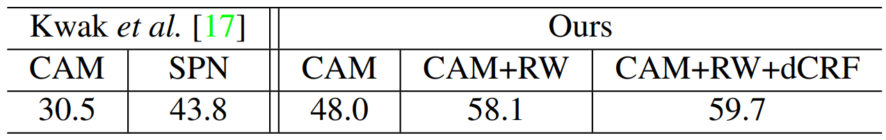
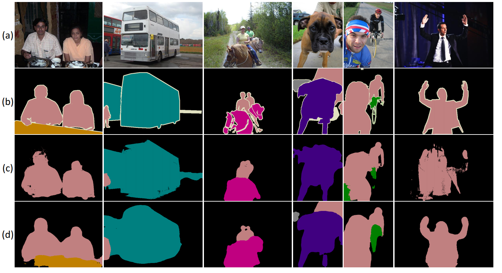

* [paper](paper/2018-Learning%20Pixel-level%20Semantic%20Affinity%20with%20Image-level%20Supervision%20for%20Weakly%20Supervised%20Semantic%20Segmentation.pdf)
## when

* cvpr18，目前top榜第一。有代码。

### who

* 基于像素级标签的图像语义分割

## why 提出

- 分割标签的不足是在自然环境中使用语义分割的主要障碍之一。
- 为了解决这个问题，我们提出了一种新颖的框架，可以根据图像级别的标签生成图像的分割标签。
- 在这种弱监督的环境中，已知训练的模型将局部鉴别部分而不是整个对象区域分割。我们的解决方案是将这种定位响应传播到属于同一语义实体的附近区域。
- 为此，我们提出了一种称为AffinityNet的深度神经网络，它可以预测一对相邻图像坐标之间的语义关联。然后通过AffinityNet预测的相似度随机游走来实现语义传播。更重要的是，用于训练AffinityNet的监督由初始鉴别部分分割给出，其作为分割标注是不完整的，但足以用于学习小图像区域内的语义关联。因此，整个框架仅依赖于图像级类标签，并且不需要任何额外的数据或标注。在PASCAL VOC 2012数据集中，通过我们的方法生成的分割标签学习的DNN优于以前受过相同监督级别训练的模型，甚至比依赖更强监督的模型更具竞争力。

## where（适用范围，优点，缺点， 创新点，以前的方法）

### 出发点

* 深度神经网络（DNNs）的最新发展推动了语义分割的显着改进 [2, 3, 4, 19, 22, 25, 32, 39] 。 然而，尽管DNN取得了巨大成功，但我们在不受控制和现实的环境中实现语义分割还有很长的路要走。 其中一个主要障碍是缺乏训练数据。 由于像素级分割标签的标注成本过高，现有数据集通常缺乏标注样本和类别多样性。 这使得传统方法限于在数据集中预定义的小范围的对象类别。
* 已经研究了弱监督方法来解决上述问题并允许语义分割模型更具可扩展性。 他们的共同动机是利用像边界框 [6, 12, 28] 和线 [18, 36] 这样的标注，这些标注比像素级标签弱，但在大量视觉数据中很容易获得，或者由于其低标注而易于获得成本。 在用于语义分割的各种类型的弱标注中，图像级类标签已被广泛使用 [11, 14, 17, 26, 29, 30, 37]，因为它们已经在现有的大规模图像数据集中给出（例如，ImageNet [7]）或通过搜索关键字自动标注图像检索结果。 然而，利用图像级标签监督来学习语义分割是一个非常病态的问题，因为这种监督仅指示某个对象类的存在，并且不告知对于学习分割必不可少的对象位置和形状。
* 这一系列研究中的方法已经纳入了额外的证据来模拟监督中缺少的位置和形状信息。定位线索的一个流行选择是类激活图（CAM）[40]，它通过追踪隐藏单元对分类DNN输出的贡献来突出显示目标对象的局部鉴别部分。 CAM突出显示的鉴别区域又被用作种子，它们将被传播以覆盖整个对象区域。为了从种子中准确地恢复对象区域，先前的方法利用图像分割 [17, 30] ，视频中的运动 [35] 或两者 [11] ，所有这些都可用于估计对象形状。出于同样的目的，估计了类别不可知的显着区域，并将其与种子结合在一起 [26] 。然而，他们需要额外的数据（即视频）[11, 35]，额外的监督（即对象边界框） [26] ，或者不能利用表示学习的现成技术（即图像分割）在DNNs [11, 17, 30] 。

* 在本文中，**我们提出了一种简单而有效的方法来补偿物体形状的缺失信息，而无需外部数据或额外的监督**。我们框架的关键组件是AffinityNet，它是一个DNN，它将图像作为输入并预测相邻图像坐标对的语义相似。给定一个图像及其CAM，我们首先构建一个邻域图，其中每个像素在一定半径内连接到它的相邻，并通过AffinityNet估计图中连接的对的语义相似度。然后，对于每个类，CAM中的稀疏激活通过图上的随机游走[23]进行扩散：图中边缘的相似度鼓励随机游走将激活传播到附近和语义上相同的区域，并惩罚传播到其他类的区域。这种语义扩散显着地修改了CAM，从而恢复了精细的对象形状。我们将此过程应用于训练图像，以便通过获取与每个像素处修改的CAM的最大激活相关联的类标签来合成其分割标签。生成的分割标签用于训练出用于测试的分割模型。
* 剩下的问题是如何在没有额外数据或额外监督的情况下学习AffinityNet。 为此，训练图像的初始CAM被用作监督源。 由于CAM经常遗漏一些对象部分并出现错误，因此它们不完整，作为学习语义分割的监督，其目的是准确地预测整个对象mask。 然而，我们发现它们通常是局部正确的，并提供证据来识别小图像区域内的语义相似度，这是AffinityNet的目标。 为了生成定位语义相似度的可靠标签，我们忽略了CAM上具有相对较低激活分数的区域，以便仅保留高置信对象和背景区域。 然后通过对置信区域上的一对相邻图像坐标进行采样来获得训练样本，并且如果其坐标属于相同类别则其二进制标签为1，否则为0。

### 创新点

* 所提出的方法的总体流程如图1所示。首先，计算训练图像的CAM并用于生成语义相似标签，其用作训练AffinityNet的监督。 然后，我们将训练好的AffinityNet应用于每个训练图像，以计算其邻域图的语义相似度矩阵，该矩阵在随机游走中用于修改其CAM并获得合成的分割标签。 最后，生成的分割标签用于训练语义分割DNN，这是将在测试时使用的唯一网络。 我们的贡献是三方面的：
  * 我们提出了一种名为AffinityNet的新型DNN，它可以预测像素级的高级语义相似度，但仅使用图像级类标签进行训练。
  * 与大多数以前的弱监督方法不同，我们的方法不依赖于现成的方法，并通过AffinityNet的端到端训练利用表示学习。
  * 在PASCAL VOC 2012 [8]中，我们在同等级别的监督下训练的模型中实现了最先进的性能，并且与依赖于更强监督或外部数据的模型相比具有竞争力。 令人惊讶的是，它甚至优于FCN [22]，这是早期众所周知的全监督模型。

* 图1.我们的方法的插图。 对象类和背景的显着区域首先由CAMs [40]（第3.1节）定位在训练图像中。 从显着区域，我们采样成对的相邻坐标，并根据它们的类一致性为它们分配二进制标签。 然后使用标记的对来训练AffinityNet（第3.2节）。 经过训练的AffinityNet反过来预测局部图像区域内的语义相似度，这些区域与随机游走相结合以修改CAM（第3.3节）并生成它们的分割标签（第3.4节）。 最后，生成的标注被用作监督以训练语义分割模型。

### 以前的方法

**各类弱监督**

* 已经对用于语义分割的弱监督方法进行了广泛研究，以解决数据缺陷问题。 语义分割的弱监督的成功例子包括边界框 [6, 12, 28] ，线 [18, 36] ，点 [1] 等。 然而，这些类型的弱监督在标注过程中仍然需要一定量的人为干预，因此为大量视觉数据标注这些弱标签是昂贵的。

**图像级标签作为弱监督**

* 图像级类标签已被广泛用作语义分割的弱监督，因为它们要求最少或不需要人工干预进行标注。 早期的方法试图直接从图像级标签中训练分割模型[28,29]，但是它们的性能并不令人满意，因为标签太粗糙而无法学习分割。 为了解决这个问题，一些先前的方法结合了由鉴别定位技术[27,40]给出的分割种子以及超像素 [11, 17, 30]，分割提议 [30] 和视频中的动作 [11, 35] 等其他证据。它可用于估计物体形状，并通过现成的无监督技术获得。

* 我们基于AffinityNet的框架与上述方法相比具有明显的优势。 AffinityNet从数据中学习如何将定位激活传播到整个对象区域，而以前的方法无法获得这样的优势。 与我们的一样，一些方法可以提高分割质量，而无需现成的预处理。 Wei等人[37]建议通过顺序搜索新的和互补的对象区域逐步扩展分割结果。 另一方面，Kolesnikov和Lampert [14] 学习了一种分割模型来逼近应用于CAM给出的分割种子的密集条件随机场（dCRF）[15] 的输出。

**学习像素级相似度**

* 我们的工作也与学习像素级预测相似矩阵的方法密切相关 [2, 5, 36] 。具体地，图像的以像素为中心的相似度矩阵由在[2,5]中用分割标签训练的DNN估计。Bertasius等人 [2] 将相似矩阵与随机游走相结合，其作用是细化像dCRF这样的分割模型的输出。 Cheng等人 [5]设计了一个反卷积网络，其中上池化层利用相似度矩阵在上采样期间恢复清晰的边界。上述两种方法都旨在细化像素级中完全监督的分割模型的输出。相反，我们的目标是通过高级语义相似度矩阵从对象部分的粗糙和嘈杂响应中恢复对象形状，并且AffinityNet具有完全不同的体系结构。 Vernaza和Chandraker [36]采用线作为弱监督，并提出同时学习分割网络和随机游走相似度矩阵，以便网络的输出和线的随机游走传播变得相同。我们的方法在以下三个方面与此工作不同。首先，我们的框架使用图像级标签进行训练，这些标签明显弱于[36]中使用的线。其次，在我们的方法中，随机游走可以跳到某个半径内的任何其他位置，但在[36]中，它只允许移动到四个最近的邻居。第三，AffinityNet明确地学习成对语义关联，但[36]中的模型隐含地学习它。

**学习合成标签**

* 我们采用不相交的传递途径，首先生成合成标签，并以完全监督的方式训练带有标签的分割模型。 已经研究了这种传递途径用于物体检测[34]以及弱监督设置中的语义分割 [6, 11, 12, 17, 26, 35]。 我们的方法的一个独特之处是AffinityNet，与采用现有优化技术的先前方法（例如，GraphCut，GrabCut和dCRF）和/或上述现成的预处理步骤相比较，端到端的可训练DNN显着提高合成标签的质量。

## how

我们的弱监督语义分割方法大致分为两部分：

1. 合成给定图像级标签的训练图像的像素级分割标签，
2. 利用生成的分割标签学习DNN用于语义分割。 整个框架基于三个DNN：网络计算CAM，AffinityNet和分割模型。 前两个用于生成训练图像的分割标签，最后一个是执行实际语义分割的DNN，并且使用合成的分割标注进行训练。 本节的其余部分将详细介绍三种网络的特征及其训练方案。

### 1.计算CAM

* CAM在我们的框架中发挥着重要作用。 与许多其他弱监督方法一样，它们被视为分割种子，它通常突出显示对象的局部显着部分，然后传播以覆盖整个对象区域。 此外，在我们的框架中，他们被用作训练AffinityNet的监督来源。

* 我们遵循[40]的方法来计算训练图像的CAM。 该体系结构是典型的分类网络，具有全局平均池化（GAP），后跟全连接层，并且通过具有图像级标签的分类标准进行训练。 给定训练的网络，由McMc表示的真实情况类c的CAM由下式计算：

### 2. 学习AffinityNet

* AffinityNet旨在预测训练图像上一对相邻坐标之间的类不可知语义关联。 预测的相似度在随机游走中用作转移概率，使得随机游走将CAM的激活得分传播到同一语义实体的附近区域，这显着提高了CAM的质量。

#### 2.1. 生成语义相似标签

* 为了使用图像级标签训练AffinityNet，我们利用训练图像的CAM作为不完整的监督来源。 尽管如图2所示，CAM通常是不准确的，但我们发现通过仔细操作它们，可以获得对语义相似度的可靠监督。

* 我们的基本思想是从CAM中识别物体和背景的高置信区域，并仅从这些区域中获取训练样本。 通过这样做，可以可靠地确定一对采样坐标之间的语义等价。 为了估计物体的高置信区域，我们首先通过减小等式(2)中的α来放大Mbg。使背景得分主导CAM中对象的无关紧要的激活得分。 在将dCRF应用于CAM进行细化之后，我们通过收集目标类别得分大于任何其他类别（包括放大背景）的坐标来确定每个对象类的可靠区域。 而且，在相反的设置中（即增加α以减弱Mbg），可以以相同的方式识别高置信的背景区域。 然后，图像中的剩余区域被视为中性。 该过程的结果如图4(a)所示。

图4. 生成语义相似标签的概念图。(a) 对象类和背景的高置信区域：桃色为人，绿色为植物，黑色为背景。中性区域采用白色进行颜色编码。(b) 在小半径内采样的坐标对用于训练AffinityNet。如果两个坐标来自同一个类，则为每个对分配标签1，否则标记为0。 当两个坐标中的至少一个属于中性区域时，在训练期间忽略该对。

* 现在，可以根据由置信区域确定的类标签将二元相似标签分配给每对坐标。 对于非中性的两个坐标(xi,yi)和(xj,yj)，如果它们的类相同，则它们的相似标签Wij∗为1，否则为0。此外，如果至少有一个坐标是中性的，我们只是在训练期间忽略该对。该方案如图4(b)所示，使我们能够收集相当大量的成对相似标签，这些标签也足够可靠。

#### 2.2. AffinityNet训练

注意，等式(10)中的损失是不可知类别的。因此，训练好的AffinityNet决定两个相邻坐标之间的类一致性，而不明确地知道它们的类。 这种类别不可知的方案允许AffinityNet学习可以在多个对象类和背景之间共享的更一般的表示，并且显着地扩大每个类的训练样本集。

### 3. 使用AffinityNet修改CAM

* 经过训练的AffinityNet用于修改训练图像的CAM。 AffinityNet预测的局部语义相似度被转换为转移概率矩阵，这使得随机游走能够识别图像中的语义边界，并鼓励它在这些边界内扩散激活分数。 我们凭经验发现，使用语义转换矩阵的随机游走可以显着提高CAM的质量，从而使我们能够生成准确的分割标签。

* 对于输入图像，AffinityNet生成卷积特征图，并且根据等式(3)计算映射中的特征之间的语义相似度。 注意，如在AffinityNet的训练中，在半径γ的局部圆内的特征之间计算相似度。 计算出的相似度形成相似度矩阵W，其对角元素为1。随机游走的转移概率矩阵T从相似度矩阵导出如下：

### 4. 学习语义分割网络

* 然后，修改的训练图像的CAM用于生成图像的分割标签。 由于CAM的尺寸小于其输入图像，我们通过双线性插值将它们上采样到图像的分辨率，并使用dCRF对其进行细化。 然后简单地通过选择与修改的和上采样的CAM中的每个像素处的最大激活分数相关联的类标签来获得训练图像的分割标签。 请注意，因为我们为背景和对象类计算CAM，所以也可以选择背景类。

* 通过上述过程获得的分割标签用作监督以训练分割网络。 在我们的方法中可以使用任何完全监督的语义分割模型，因为我们提供训练图像的分割标签。

### 5. 网络结构

* 在本节中，我们将介绍在我们的框架中采用的DNN架构的详细信息。 请注意，我们的方法可以使用任何现有的DNN实现相同的目的，尽管我们仔细设计以下模型以增强分割性能。

#### 骨干网络

* 我们框架中的三个DNN都建立在相同的骨干网络上。 主干是模型A1 [38]的修改版本，也称为ResNet38，具有38个具有宽通道的卷积层。 为了获得骨干网络，首先去除原始模型的最终GAP和全连接层。 然后将最后三个级别的卷积层替换为具有公共输入步幅1的带孔卷积，并且调整它们的扩张率以使得骨干网络将返回步幅8的特征图。已知带孔卷积通过扩大感受野而不牺牲特征图分辨率来提高分割质量[4]。 我们凭经验观察到它也适用于我们的弱监督模型CAM和AffinityNet，因为它使模型能够恢复精细形状的物体。

#### 我们框架中DNN的详细信息

**网络计算CAM**
我们通过在骨干网络顶部按顺序添加以下三层来获得此模型：具有512个通道的3×3卷积层，用于更好地适应目标任务，用于特征映射聚合的全局平均池化层，以及全连接层用于分类。

**AffinityNet**
该网络被设计用于聚合骨干网络的多级特征映射，以便在计算相似度时利用在各种视野中获取的语义信息。 为此，选择从骨干网络的最后三个级别输出的特征映射。 在聚合之前，对于第一，第二和第三特征图，它们的信道维度分别减少到128，256和512，分别由单个1×1卷积层。 然后将特征映射连接成具有896个通道的单个特征映射。 我们最终在顶部添加了一个1×1卷积层和896个通道用于自适应。

**分割模型**
我们严格遵循[38]来构建我们的分割网络。 具体来说，我们在骨干网络的顶部放置了两个更复杂的卷积层。 它们具有相同的扩张率12，而第一个通道的数量为512，第二个通道的数量为21。 生成的网络在下一节中称为“Ours-ResNet38”。

## how much

**数据集**
我们框架中的所有DNN都在PASCAL VOC 2012分割基准上进行了训练和测试，以便与之前的方法进行公平比较。 按照惯例，我们通过采用[9]中提出的分割标注来扩大训练图像集。 因此，总共使用10,582个图像作为训练样本，并保留1,449个图像用于验证样本。

**网络参数优化**
我们DNN的骨干网络在ImageNet上进行了预训练[7]。 然后，Adam[13]在PASCAL VOC 2012上对整个网络参数进行了微调。 在训练所有三个DNN时，通常使用以下数据增强技术：水平翻转，随机裁剪和颜色抖动[16]。 此外，对于除AffinityNet之外的网络，我们在训练期间随机缩放输入图像，这对于在网络上施加比例不变性是有用的。

**参数设置**
公式(2)中的αα默认为16，并分别变为4和24以放大和减弱背景激活值。 我们设置等式(4)中的γ为5，等式(11)中的β为8。此外，在等式(12)中的tt固定为256。对于dCRF，我们使用原始代码中给出的默认参数。

### 合成分割标签的分析

我们的标签合成方法的性能在真实分割和生成的分割标签之间以mIoU测量，如表1所示。对于模块研究，我们的方法分为三个部分：CAM，RW（使用AffinityNet随机游走）和dCRF。为了证明所提出的方法的优势，我们还报告了超像素池化网络（SPN）[17]的得分，其将CAM与超像素结合作为用于生成具有图像级标签监督的分割标签的附加线索。如表1所示，即使我们的CAM在生成的分割标签的质量方面优于SPN，而不使用超像素等现成方法。我们相信这是因为各种数据增强技术和更强大的骨干网络以及带孔卷积层。此外，通过随机游走和学习的语义相似度，分割标注的质量得到显着提高，证明了AffinityNet的有效性。最后，dCRF进一步略微提高了标签质量，我们使用最后一个版本作为学习分割网络的监督。

表1. mIoU中合成分割标签的准确度，在PASCAL VOC 2012训练集上评估。SPN：超像素池化网络[17]，RW：使用AffinityNet随机游走。

图5中显示了合成分割标签的例子，其中可以看到AffinityNet的随机游走有效地处理CAM中的错误和缺失区域。 为了说明AffinityNet在此过程中的作用，我们还通过检测特征图fafffaff上的边缘来可视化图像的预测语义相似度，并观察到AffinityNet具有检测语义边界的能力，尽管它是使用图像级标签进行训练的。 由于这样的边界惩罚语义上不同的对象之间的随机游走传播，所以合成的分割标签可以恢复准确的对象形状。

> 上图d中，黑色区域表示边界，因为附近类别不一致，白色表示内部，因为类别一致；

### 与以前的研究比较

我们首先定量地将我们的方法与仅基于图像级类标签的先前方法进行比较。 PASCAL VOC 2012的结果总结在表2和表3中。请注意，我们还评估了使用我们的合成标签（称为“Ours-DeepLab”）进行训练的DeepLab [4]，以便与其骨干为VGG16的其他模型进行公平比较[33] 。我们的两个模型在基准的验证集和测试集上的平均精度方面都优于当前的方法水平[37]，而Ours-ResNet38略好于Ours-DeepLab，这得益于ResNet38更强大的表示。我们的模型也与表4中基于额外训练数据或更强监督的方法进行了比较。它们基本上优于基于相同监督水平的方法，但有额外的数据和标注，如MS-COCO中的分割标签[20]，MSRA Saliency [21]和YouTube视频[31]中使用了不可知类别的边界框。他们还依赖于像线和边界框这样强有力的监督，与之前的方法竞争。令人惊讶的是，Ours-ResNet38甚至优于FCN [22]，这是众所周知的关于全监督语义分割的早期工作。这些结果表明，我们的方法生成的分割标签足够强大，可以替代额外的数据或更强的监督。我们最终将我们的模型与全监督的版本DeepLab [4]和ResNet38 [38]进行比较，这是我们可以实现的上限。具体而言，Ours-DeepLab恢复了86％的界限，而Ours-ResNet38则达到了77％。

表2. 与仅基于图像级标签的弱监督方法相比，PASCAL VOC 2012验证集的性能。

表3. 与仅基于图像级标签的弱监督方法相比，PASCAL VOC 2012测试集的性能。

表4. PASCAL VOC 2012验证集和测试集的性能。监督类型（Sup.）表示：P-实例点，S-线，B-边界框，I-图像级标签和F-分割标签。

图6显示了Ours-ResNet38的定性结果，并将它们与CrawlSeg [11]的定性结果进行了比较，后者是使用图像级监督的当前最新方法。 我们的方法仅依赖于图像级标签监督，即使CrawlSeg利用额外的视频数据来合成分割标签，也可以产生更准确的结果。

图6. PASCAL VOC 2012验证集的定性结果。(a) 输入图像。(b) 真实分割。(c) CrawlSeg [11]获得的结果。(d) 我们的结果-ResNet38。 与CrawlSeg相比，CrawlSeg是基于图像级标签监督的当前最先进的模型，我们的方法更好地捕获更大的对象区域并且更不容易遗漏对象。 我们的结果的对象边界比CrawlSeg的对象边界更平滑，因为我们不将dCRF应用于最终结果。 在补充材料中可以找到更多结果。

# 结论

为了减轻语义分割中缺少标注数据问题，我们提出了一种基于AffinityNet的新型框架，仅在给定图像级别标签的情况下生成训练图像的准确分割标签。 我们的方法的有效性已在PASCAL VOC 2012基准测试中得到证明，其中使用我们的方法生成的标签训练的DNN基本上优于先前依赖于相同监督水平的方法水平，并且与那些要求更强监督或额外数据的方法相比具有竞争力。