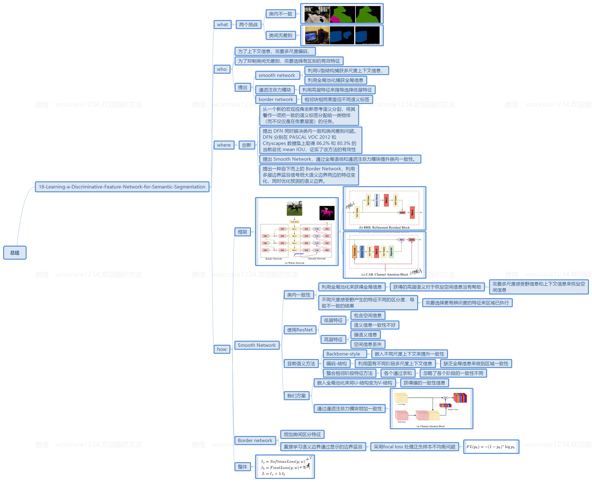
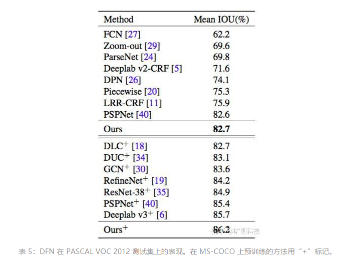

- [paper](paper/2018-Learning-a-Discriminative-Feature-Network-for-Semantic-Segmentation.pdf)

## when

-  CVPR 2018

## what

- 在大量的计算机视觉应用中，语义分割是一项不可或缺的底层技术。
- 旷视科技Face++近期发表的一篇 CVPR 2018 收录论文《Learning a Discriminative Feature Network for Semantic Segmentation 》提出判别特征网络 DFN，有效解决了语义分割的两个基本问题，显著提高了其精度，可以帮助机器之眼更好地理解复杂的图像和场景，解析静态或动态人体及其他物体，有助于从根本上推动自动驾驶、手机影像、医疗影像、无人零售、物流安防等 AI 驱动型产业的普及与发展。

### who （动机）

### 出发点

- 本文提出的判别特征网络（Discriminative Feature Network/DFN）包含两个子网络 Smooth Network 和 Border Network，它有效解决了绝大多数现有语义分割方法面临的**类内不一致（intra-class inconsistency）**与**类间无差别（inter-class indistinction）**问题。
- 具体而言，为应对类内不一致问题，作者专门设计带有通道注意力模块（Channel Attention Block/CAB）和全局平均池化的 Smooth Network 以选择更具判别力的特征；而 Border Network 则借助多层语义边界监督区分边界两边的特征。
- 伴随着以全卷积网络（Fully Convolutional Network/FCN）为代表的卷积神经网络的新近发展，很多工作成效显著。但是，上述网络学习的特征经常存在判别性不强，难以区分的问题，表现为：1) 标签相同但外观不同的图像块，称之为类内不一致，如图 1 第一行所示；2) 两个相邻的图像块，标签不同但外观相似，称之为类间无差别，如图 1 第二行所示。

### 我们的方法

* 为解决上述两个挑战，本文从一个更加宏观的角度重新思考语义分割，将其看作一项把一致的语义标签分配给一类物体而不是每个单一像素的任务。这就需要把每个类别的像素看作一个整体，进而同时兼顾类内一致（intra-class consistency）与类间差别（inter-class variation）。这意味任务需要判别特征，所以本文提出一个全新的判别特征网络(DFN) 以学习特征表征。
* DFN 有两个组件：Smooth Network 和 Border Network。Smooth Network 用来解决类内不一致问题，从而需要学习一个鲁棒特征表征，为此本文主要考虑两个关键因素。一方面，需要多尺度和全局语境特征编码局部和全局信息。比如，由于缺乏足够的语境信息，图 1(a) 中的白色小图像块经常无法预测正确的类别；另一方面，随着引入多尺度语境，对于一定尺度的物体来说，特征具有不同程度的判别力，其中一些可能预测假标签。因此，有必要选择高效的判别特征。正是出于上述两方面的考虑，Smooth Network 展现为 U 形结构，以抓取不同尺度的语境信息，并通过全局平均池化抓取全局语境。此外，本文还提出通道注意力模块(CAB)，利用高层特征逐阶段地指导低层特征的选择。

- Border Network 负责区分外观相似但标签不同的相邻图像块。大多数现有方法把语义分割看作一种密集识别问题，无法明确建模类间关系。以图 1(d) 为例，如果越来越多的全局语境整合进分类过程，相邻于显示器的电脑主机由于外观相似很容易被误认是显示器。因此，明确地使用语义边界指导特征的学习非常重要，这可以增强特征两边的变化。训练时，作者把语义边界损失整合进 Border Network 以学习判别特征，增大类间差别。

## where

### 创新点

- 从一个新的宏观视角重新思考语义分割，将其看作一项把一致的语义标签分配给一类物体（而不仅仅是在像素层面）的任务。
- 提出 DFN 同时解决类内一致和类间差别问题。DFN 分别在 PASCAL VOC 2012 和 Cityscapes 数据集上取得 86.2% 和 80.3% 的当前最优 mean IOU，证实了该方法的有效性。
- 提出 Smooth Network，通过全局语境和通道注意力模块提升类内一致性。
- 提出一种自下而上的 Border Network，利用多层边界监督信号增大语义边界两边的特征变化，同时优化预测的语义边界。

## how

### 网络架构

* DFN的网络架构，首先详述它的两个组件 Smooth Network 和 Border Network；接着，具体解释两者如何实现类内一致和类间差别；最后描述 DFN 完整的编码器-解码器网络架构。有关

### Smooth Network

* 绝大多数现有方法无法保证正确预测每个图像块的类别，尤其当图像块属于较大区域和复杂场景之时；这种类内不一致问题的主要原因在于语境的缺失，为此作者提出带有全局平均池化的全局语境。但是，全局语境只具有高语境信息，无助于复原空间信息，作者需要多尺度感受野和语境来优化空间信息，正如大多数现有方法那样。然而，由于不同尺度的感受野其判别力也各不相同，从而造成不一致的结果，从而需要选择更具判别力的特征预测某个特定类别的统一语义标签。

* 具体而言，本文使用 ResNet 作为基础识别模型；根据特征图大小，该模型可划分为 5 个阶段。据观察，不同阶段识别能力各不相同，一致性表现也各不相同。在低级阶段，网络编码更精细的空间信息，但是由于缺乏空间语境指导和感受野较小，其语义一致性表现欠佳；而在高级阶段，由于感受野较大，语义一致性表现较佳，但是预测的空间信息较粗糙。总体而言，低级阶段有着更精确的空间预测，而高级阶段有着更精确的语义预测。基于这一观察，本文提出 Smooth Network 以整合两者的优势，利用高级阶段的一致性指导低级阶段获得最优的预测。

* 当下流行的语义分割架构主要有两种 style，一种是 Backbone，如 PSPNet 和 Deeplab v3；另一种是 Encoder-Decoder，比如 RefineNet 和全局卷积网络。但上述架构并不完备，为此，本文首先嵌入一个全局平均池化层把 U 形架构扩展为 V 形架构，为网络引入最强的一致性约束作为指导；此外，本文提出通道注意力模块以优化一致性，如图 2(c) 所示。该设计结合相邻阶段的特征以计算通道注意力向量（图 3(b)）。高级阶段的特征给出一个强大的一致性指导，而低级阶段的特征给出特征的不同判别信息，从而通道注意力向量可以选择判别特征。

* **通道注意力模块** CAB 的设计目的是改变每一阶段的特征权重以优化一致性，如图 3 所示。在 FCN 架构中，卷积算子输出一个 score map，给出每一类别在每个像素上的概率。其实际意义在于暗示了不同通道的权重是平等的。然而，如上所述，不同阶段的特征判别力不同，造成预测的一致性各不相同。为实现类内一致预测，应该提取判别特征，并抑制非判别特征，从而可以逐阶段地获取判别特征以实现预测类内一致。

* **优化残差模块** 特征网络中每一阶段的特征图全都经过 RRB，如图 2(b) 所示。该模块的第 1 个组件是 1 x 1 卷积层，作者用它把通道数量统一为 512。同时，它可以整合所有通道的信息。接着是一个基本的残差模块，它可以优化特征图。此外，受 ResNet 启发，该模块还可以强化每一阶段的识别能力。

### Border Network

* 在语义分割任务中，预测经常混淆外观相似的不同类别，尤其当它们在空间上相近之时，因此需要加大特征的差别。出于这一考虑，本文采用语义边界指导特征学习，同时应用显式监督提取精确的语义边界，使网络学习类间差别能力强大的特征，进而提出 Border Network 加大特征的类间差别。Border Network 直接通过显式语义边界监督学习语义边界，类似于语义边界检测任务。这使得语义边界两边的特征变得可区分。

* 本文的工作需要语义边界具有更多的语义含义。因此 Border Network 的设计是自下而上的。它可以同时从低级阶段获取精确的边界信息和从高级阶段获取语义信息，从而消除一些缺乏语义信息的原始边界。由此，高级阶段的语义信息可以逐阶段地优化低级阶段的细节边界信息。借助传统的图像处理方法，比如 Canny，作者可以从语义分割的 groundtruth 中获得网络的监督信号。Border Network 主要关注分离边界两边的类别的语义分割。要精确地提取语义边界，需要两边的特征更加可区分，而这正是作者的目的所在。

### 网络结构

* 作者使用预训练的 ResNet 作为基础网络。Smooth Network 通过在网络顶部添加全局平均池化层以获得最强的一致性；接着利用 CAB 改变通道的权重进一步提升一致性。同时，Border Network 通过明确的语义边界监督获得精确的语义边界并使两边的特征更易区分。由此，类内特征更加一致，类间特征更易区分。

* 对于显式的特征优化，需要使用多层监督以获取更佳性能，同时网络也更容易训练。Smooth Network 借助 softmax loss 监督每一阶段的上采样输出（全局平均池化层除外），而本文借助 focal loss 监督 Border Network 的输出。两个子网络在一起联合训练，其 loss 通过一个参数控制两者的权重。

## how much

### 实验结果

* 本文在两个开源数据集 PASCAL VOC 2012 和 Cityscapes 上评估这一方法。数据集介绍、实现细节结果分析等从略，本文将直接给出 DFN 最终的评估结果，了解更多请参见原论文。

## why （为什么好）

* 加入了边界监督信息；
* 使用残差网络来学习相邻阶段特征，底层有细节，高层有语义；
* 使用CBA来融合不同特征，让底层特征和高层特征不同权重；

