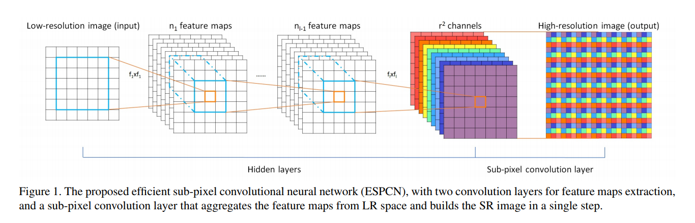
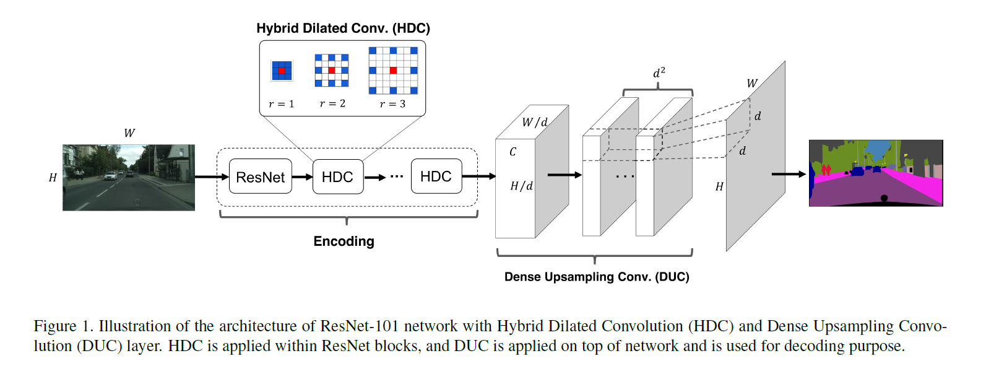
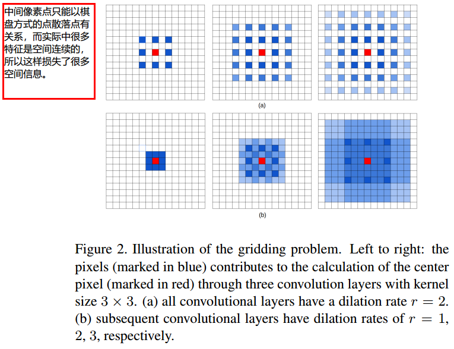

* [paper](paper/2018-Understanding%20Convolution%20for%20Semantic%20Segmentation.pdf)
* [语义分割--Understand Convolution for Semantic Segmentation](https://blog.csdn.net/u011974639/article/details/79460893)

#### 动机

##### 1. 编码部分的问题

* 对于编码部分，空洞卷积由于其可以增大感受野、控制分辨率从而消除了下采样的需要。
* 但是空洞卷积固有的问题就是gridding现象，因为卷积核中间加入了0(空洞)，感受野只获取了非0区域的信息，丢失了一些邻居(局部)信息。当rate逐渐增大，这个问题越来越严重，通常是在深层网络中，感受野特别大，造成卷积核中两个非0权重的距离太远，卷积核太稀疏以至于不能覆盖任何局部信息。某个固定位置像素的信息总是来自与具有griding的模式下。
* 本文提出混合空洞卷积，使用一系列空洞卷积然后把feature map级联在一起。这个方法有效的减轻gridding问题。而且选择合适的rate可以提高感受野和精确度。

##### 2. 解码部分的问题
* 大部分语义分割模型主要采用双线性插值上采样来获得输出label map。但是双线性插值不是可学习的而且会丢失信息。
* 本文提出了密集上采样卷积(DUC)，来一次性恢复label map的全部分辨率，通过学习一系列上采样滤波器来对下采样的feature map进行恢复到要求的分辨率。

#### 贡献

* 本文首先提出了 dense upsampling convolution，可以捕获和解码更详细的信息，这些细节信息是双线性插值不能获取的；
* 然后提出了一个 dense upsampling convolution框架，可以增加感受视野扩大全局信息，并且解决了网格问题，这是由于标准的空洞卷积造成的。

#### 方法

##### 1. DUC

* 为什么使用DUC？

  * 考虑到模型输入图片大小(H,W,C),整个模型在预测前的输出feature map大小为Fout=(h,w,c)，其中 H/d=h,W/d=wH/d=h,W/d=w，d称为下采样因子(downsampling factor)。

  * 双线性插值存在的问题：如果模型的d=16，即输入到输出下采样了16倍。如果一个目标物的长或宽长度小于16个pixel，训练label map需要下采样到与模型输出维度相同，即下采样16倍时已经丢失了许多细节, 对应的模型预测结果双线性插值上采样是无法恢复这个信息 。

* DUC的方案：

  * 针对这一问题，DUC将FoutFout的尺寸(h,w,c)通道转为到(h,w,d2×L), LL是分割类别数目。再reshape到label map大小(H,W,L)。 reshape操作代替了解卷积上采样，可直接对接label map。

  

* 从另一个角度想：DUC将整个label map(H,W,L)分为为d^2个等大小的子图(subparts)，每个子图和大小和Fout输出的feature map大小相同。也就是说将label map切分为(h,w,d2×L)。

##### 2.  Hybrid Dilated Convolution (HDC)

* 为什么HDC：
  * ”gridding现象当使用的扩张率增加，采样点之间相隔较远，局部信息丢失，产生的预测图出现网格效应。
  * 在语义分割中，通过在卷积核的每个像素之间插入0构建2-D空洞卷积空洞卷积是被用于保持feature map的高分辨率通过取代max pooling and strided convolution.同时保持了不变得感受视野。
  * 空洞卷积存在gridding，比如一个像素p在空洞卷积层l，像素p的信息来自邻近的kd x kd区域在l-1层以p为中心，空洞卷积引进了0值在卷积核中，实际上只有k x k的区域，有r-1的gap在它们之间。当dilated convolution在高层使用的rate变大时，对输入的采样将变得很稀疏，将不利于学习。因为一些局部信息完全丢失了，而长距离上的一些信息可能并不相关；并且gridding效应可能会破坏局部信息之间的连续性.

* 怎么HDC：
  * 本文中提出了HDC,假设我们有N层卷积层，kernel size为KxK, dilation rate [r1,.....ri,......rn],HDC的目标就是让最终的RF尺寸覆盖一个正方形区域 ，没有任何holes或者丢失边缘信息。HDC就是在每一层使用不同的rate，把dilatioin rate 变成锯齿形式的也就是不同层之间的dilation 不断变化。比如，所有层都有rate=2,我们构成三个连续的层作为一组，然后改变他们的rate为1，2,3.这样顶层可以访问更广的像素信息，感受视野不改变.
  * HDC的好处是可以使用任意的rate，对于识别相对大的物体表现得很好。增加RF.一组内的rate不应该有公因子关系，否则Gridding问题仍然存在，这就是HDC和ASPP最大的不同.
* 如何设计一个模块的空洞率

#### 实验

##### 1. duc

* 由图可以清晰的看见DUC主要**提高了小目标物的识别率**，验证了DUC可以恢复双线性插值上采样损失的信息。

##### 2. HDC

* 可以看到HDC有效的消除”gridding”产生的影响。

